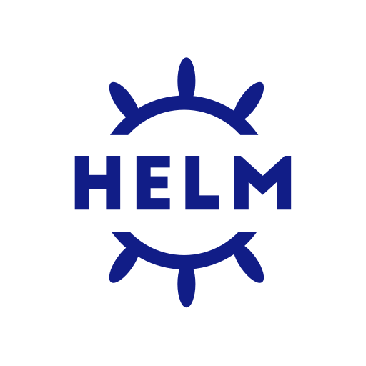
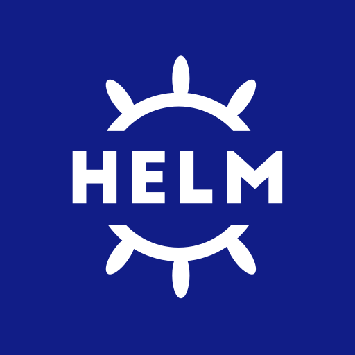
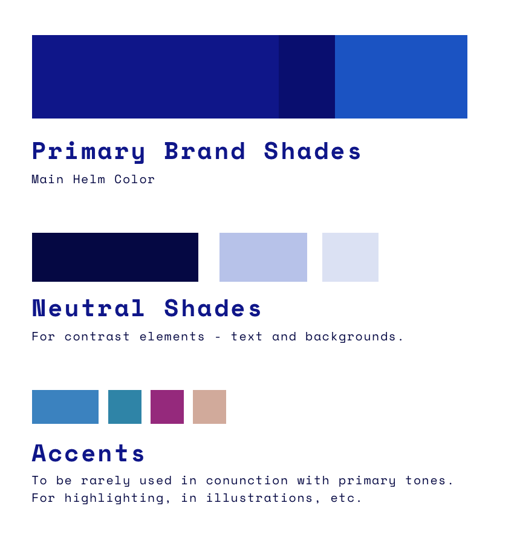
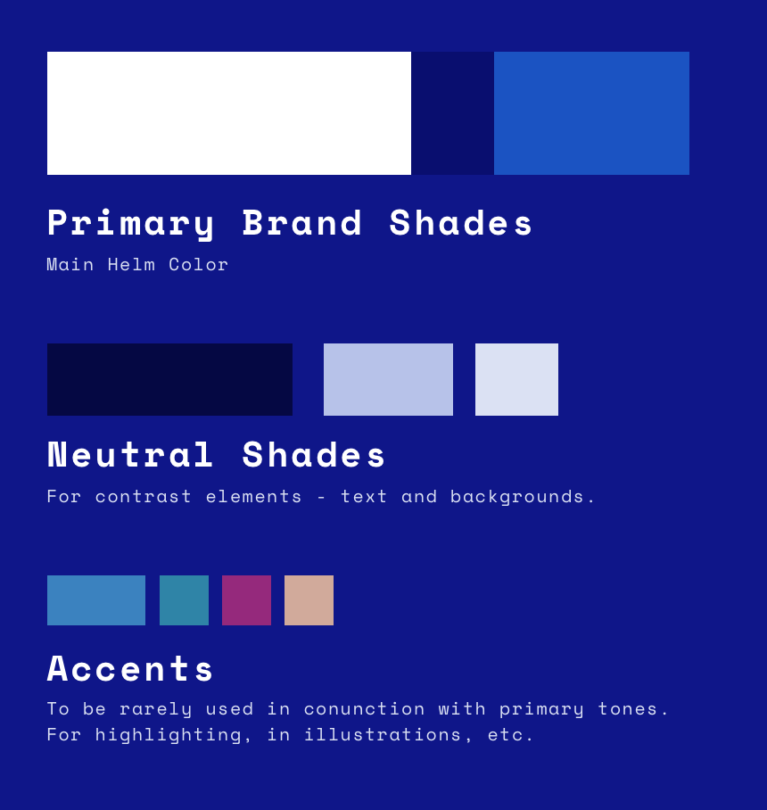
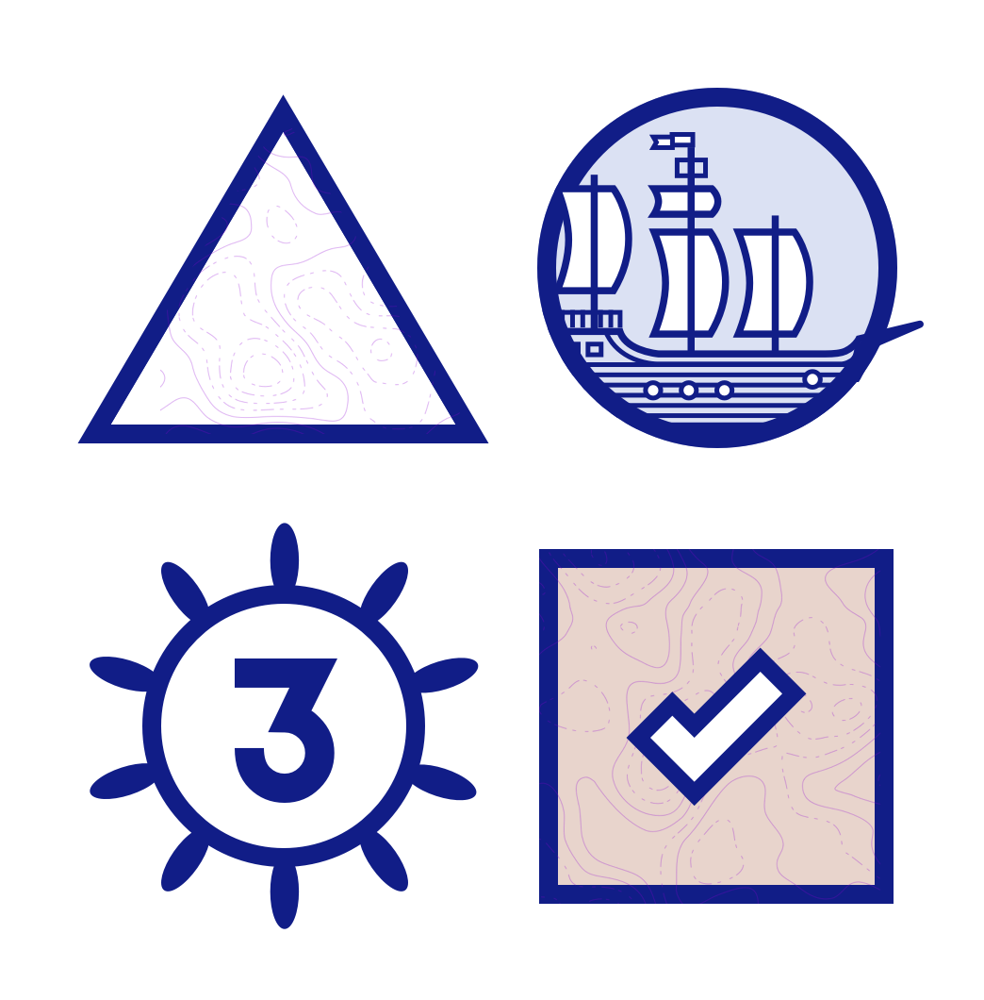
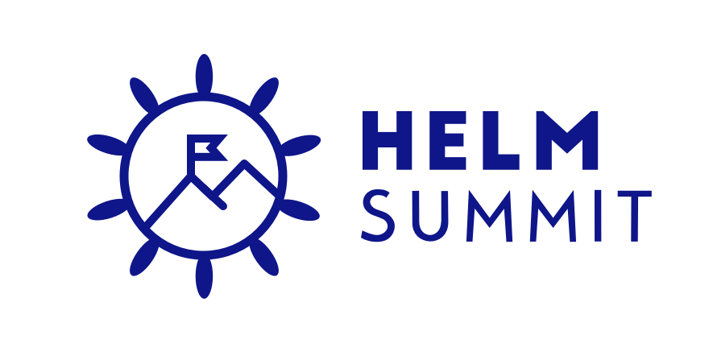
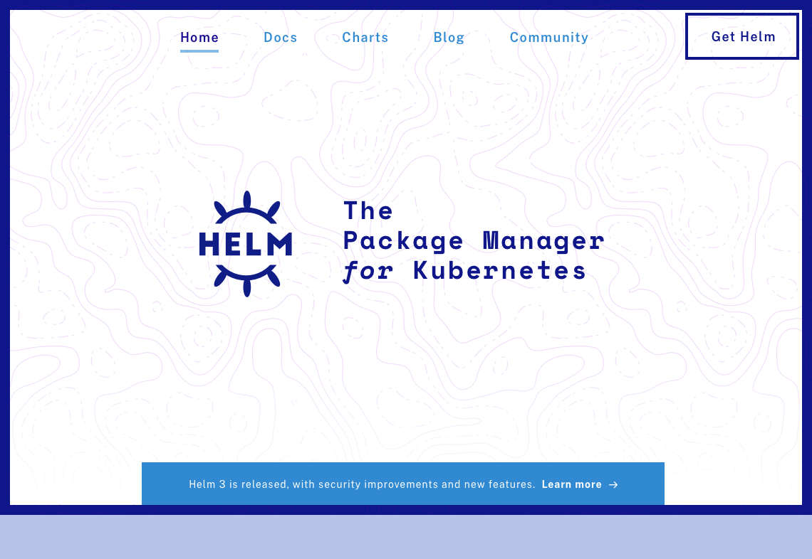

## Logo

The official Helm logo is found at the [CNCF/artwork](https://github.com/cncf/artwork/blob/master/examples/incubating.md#helm-logos) repo.






# Brand Colors






### Color Values

```
// primary
navy           #0F1689

// secondary
blue-dark      #090E6F
blue-light     #1B53C2

// shades
shade-dark     #050843
shade-mid      #B7C2E9
shade-light    #DBE1F3

// accents
accent-blue    #3B82BF
accent-green   #2F84A7
accent-red     #95297C
accent-yellow  #D1AA9B
```

# Typography


* [Space Mono](https://fonts.google.com/specimen/Space+Mono) _(Google Fonts)_
* [Public Sans](https://public-sans.digital.gov/) _(USWDS)_

---

## Examples:

Example applications of the Helm brand to different assets.


Example typography.



Illustrations and icon examples.



---


Example for a website layout.

