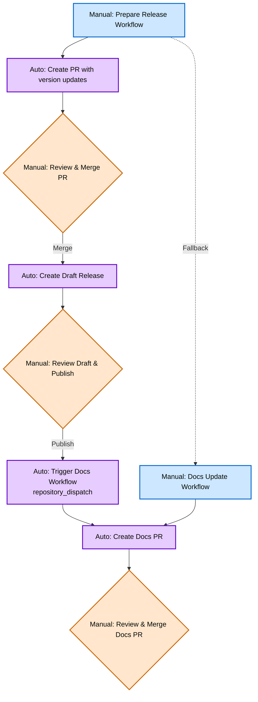

## Abstract

This HIP proposes automating significant portions of the Helm release process through GitHub Actions workflows while maintaining human oversight and security. The proposal introduces pull request-based automation for version updates, release candidate generation, documentation synchronization, and cross-repository coordination between helm/helm and helm/helm-www. The automation preserves the current manual review checkpoints while eliminating error-prone repetitive tasks, reducing release cycle time, and improving consistency.

## Motivation

The current Helm release process, documented in the [Release Checklist](https://github.com/helm/helm-www/blob/main/content/en/docs/community/release_checklist.md), involves 11 manual steps requiring maintainers to:

- Manually edit multiple files across different repositories
- Coordinate updates between helm/helm and helm/helm-www repositories
- Perform repetitive version string replacements in test files
- Manually manage GitHub milestones and releases
- Switch between multiple repository contexts during a single release

This manual process introduces several problems:

1. **Human Error**: Manual file editing leads to version mismatches and missed updates
2. **Time Consumption**: Maintainers spend significant time on repetitive tasks
3. **Context Switching**: Managing two repositories simultaneously increases cognitive load
4. **Inconsistency**: Manual processes vary between different release managers
5. **Bottlenecks**: Only maintainers familiar with the entire process can perform releases
6. **Delayed Documentation**: Website updates often lag behind releases

The existing process works but does not scale efficiently with Helm's release cadence and growing maintainer team.

## Rationale

### Design Principles

1. **Human Review Preserved**: All automation presents changes as pull requests requiring maintainer approval
2. **Security First**: No bypass of existing security measures (signed commits, GPG signatures)
3. **Draft Mode**: Automated releases created in draft mode for final human review
4. **Incremental Adoption**: Can be implemented and rolled out progressively
5. **Rollback Capability**: Easy to revert to manual process if needed

### Alternative Approaches Considered

**Full Automation**: Rejected because it removes necessary human judgment for release timing, quality assessment, and community communication.

**External Tools**: Considered tools like Release Drafter, but they lack the cross-repository coordination and Helm-specific requirements.

**Monolithic Workflow**: Rejected in favor of modular workflows that can be maintained and debugged independently.

## Specification

### Workflow Architecture

#### 1. Release Preparation Workflow (`helm/helm`)

**Trigger**: Manual workflow dispatch with inputs:
- Release type (major/minor/patch)
- Target version (e.g., v3.20.0)
- Release date

**Actions**:
1. Create release branch from main
2. Update version in `internal/version/version.go`
3. Update all test data files with new version
4. Generate release notes template using commit history
5. Create/update GitHub milestone
6. Create pull request with all changes

**Artifacts**: Pull request ready for maintainer review

#### 2. Release Candidate Workflow (`helm/helm`)

**Trigger**: Merge of release preparation PR

**Actions**:
1. Create signed, annotated git tag for RC
2. Trigger existing CI/CD for artifact building
3. Create draft GitHub release with RC tag
4. Generate and attach PGP signatures (if signing key available)
5. Post notification to configured channels

**Artifacts**: Draft GitHub release with RC artifacts

#### 3. Final Release Workflow (`helm/helm`)

**Trigger**: Manual approval/publication of RC draft release

**Actions**:
1. Create signed, annotated final release tag
2. Update draft release to final
3. Trigger documentation update workflow
4. Close milestone
5. Generate community announcement template

#### 4. Documentation Update Workflow (`helm/helm-www`)

**Trigger**: Webhook from helm/helm final release publication

**Actions**:
1. Update `config.toml` with new version information
2. Update `params.nextversion` with next planned release
3. Update version skew documentation
4. Update release calendar with next release dates
5. Create pull request in helm/helm-www

**Artifacts**: Pull request in helm/helm-www ready for review

### File Structure

```
.github/workflows/
├── prepare-release.yml          # Release preparation automation
├── release-candidate.yml        # RC creation and management
├── finalize-release.yml         # Final release publication
└── update-documentation.yml     # Cross-repo docs updates

scripts/
├── update-version-files.sh      # Version update automation
├── generate-release-notes.sh    # Release notes generation
└── update-test-data.sh          # Test file version updates
```

### Configuration

New configuration file `.github/release-config.yml`:

```yaml
# Release automation configuration
version_files:
  - path: "internal/version/version.go"
    pattern: 'version = "v{VERSION}"'
  - path: "cmd/helm/testdata/output/version.txt"
    pattern: 'Version:"{VERSION}"'
  # ... additional files

repositories:
  docs_repo: "helm/helm-www"

signing:
  gpg_key_id: "${{ secrets.GPG_KEY_ID }}"
  gpg_private_key: "${{ secrets.GPG_PRIVATE_KEY }}"
```

### Permissions and Security

Required GitHub App permissions:
- Contents: Write (for creating branches, tags, releases)
- Pull Requests: Write (for creating PRs)
- Metadata: Read (for accessing repository info)
- Actions: Write (for triggering cross-repo workflows)

Required secrets:
- `GITHUB_APP_ID`: GitHub App ID for cross-repo access
- `GITHUB_APP_PRIVATE_KEY`: GitHub App private key
- `GPG_PRIVATE_KEY`: PGP signing key (optional)

## Backwards Compatibility

This proposal introduces new automation alongside the existing manual process:

1. **Graceful Rollback**: Manual process remains fully functional if automation fails
2. **Opt-in Adoption**: Teams can choose to use automation for specific steps
3. **No Breaking Changes**: No modifications to existing release artifacts or tags
4. **Existing Tool Compatibility**: All existing tooling continues to work unchanged

The automation enhances rather than replaces the current process, ensuring maintainers can fall back to manual steps if needed.

## Security Implications

### Enhanced Security

1. **Consistent Process**: Automation reduces risk of human error in security-critical steps
2. **Audit Trail**: All changes tracked through GitHub PR system
3. **Access Control**: GitHub App permissions more restrictive than individual maintainer access
4. **Signed Commits**: Automation maintains commit signing requirements

### Security Considerations

1. **Secret Management**: GPG keys and tokens stored in GitHub Secrets
2. **Cross-Repo Access**: GitHub App tokens limited to minimum required permissions
3. **Draft Mode**: All releases created in draft mode, requiring manual publication
4. **Approval Gates**: All changes require PR approval before implementation

## How to Teach This

### Maintainer Documentation

1. Update existing release checklist with automation options
2. Create troubleshooting guide for automation failures
3. Document rollback procedures
4. Provide workflow customization examples

### Training Materials

1. Video walkthrough of automated release process
2. Comparison guide: manual vs. automated steps
3. Emergency procedures documentation
4. FAQ for common automation issues

## Reference Implementation

### Workflow Process



### User Experience

The release process starts with a **manual workflow trigger** where maintainers enter the target version (e.g., `v3.20.0`) in GitHub's workflow dispatch UI. This creates a preparation branch with all necessary version updates and opens a pull request for review.

Once the PR is **merged**, automation takes over: it creates a persistent **release branch** (like `release-3.20`) from the appropriate base branch (`main` for v4.x, `dev-v3` for v3.x), cherry-picks the version commit, creates a signed tag, and **drafts the GitHub release**. The draft sits ready for maintainer review - they can test artifacts, verify release notes, and make adjustments before publishing.

When the maintainer **publishes the draft release**, it automatically triggers the documentation workflow in the helm-www repository, creating a pull request with updated version information, release dates, and compatibility matrices. This ensures the website stays synchronized with each release without manual coordination.

**Fallback options** provide resilience: if the cross-repository automation fails, maintainers can manually trigger the docs update workflow with the same simple version input interface. Every change flows through pull request reviews, maintaining quality control while eliminating repetitive manual tasks.

The experience transforms release management from an error-prone 11-step checklist into a **three-click process**: trigger preparation, publish draft, merge docs PR.

### Example Implementation Repos

Working examples demonstrating the complete automation:
- [Example Source Repository](https://github.com/scottrigby/example-actions-autorelease-source) - Demonstrates helm/helm automation
- [Example Docs Repository](https://github.com/scottrigby/example-actions-autorelease-docs) - Demonstrates helm/helm-www automation

Example completion status:
- [x] Cross-repository automation via repository_dispatch
- [x] Draft release creation with human review gates
- [x] Persistent release branches for patch releases
- [x] Dynamic documentation updates with version/date tracking
- [x] Manual fallback workflows
- [ ] GPG signing of release artifacts
- [ ] Kubernetes version skew calculation from go.mod
- [ ] GitHub milestone management
- [ ] Release artifact attachment

### Corresponding Helm Workflow Plan

**helm/helm repository:**
- `.github/workflows/prepare-release.yml` - Creates preparation branch and PR with version updates
- `.github/workflows/trigger-release.yml` - Triggers release creation when prep PR merges
- `.github/workflows/create-release.yml` - Creates release branch, tag, and draft release
- `scripts/update-version.sh` - Updates version strings in code and test files
- `scripts/generate-release-notes.sh` - Generates release notes template from git history

**helm/helm-www repository:**
- `.github/workflows/update-version.yml` - Creates PR to update website configuration
- `.github/workflows/manual-update-docs.yml` - Manual fallback for docs updates

### Key Implementation Details

**Cross-repository communication** uses GitHub's `repository_dispatch` event to trigger the helm-www workflow when a helm/helm release is published. This requires a `HELM_RELEASE_TOKEN` secret with cross-repository access.

**Version file updates** use sed pattern matching to find and replace version strings across multiple file types, handling both semantic version formats and Go version variables.

**Pull request automation** leverages GitHub CLI (`gh`) to create PRs with proper titles and generated content, ensuring all changes go through standard review processes.

The implementation handles the three primary release types (major/minor/patch) through a single workflow with input parameters, automatically extracting version information and creating appropriate branch names.

## Rejected Ideas

### Fully Automated Releases

Rejected because release timing requires human judgment based on:
- Community feedback on release candidates
- Critical bug discovery during testing
- External factors (holidays, conferences, security issues)

### Slack/Discord Bot Interface

While potentially useful, adds complexity and another system to maintain. GitHub's existing interfaces provide sufficient control.

### Automatic Backporting

Patch release cherry-picking requires human judgment for:
- Risk assessment of changes
- Conflict resolution
- Testing scope determination

## Open Issues

1. **GPG Key Management**: Best practices for storing and rotating signing keys in CI
2. **Cross-Org Coordination**: Technical approach for coordinating releases with other CNCF projects
3. **Rollback Testing**: Comprehensive testing scenarios for automation failures
4. **Metrics Collection**: Tracking automation success rates and time savings

## References

1. [Current Release Checklist](https://github.com/helm/helm-www/blob/main/content/en/docs/community/release_checklist.md)
2. [GitHub Actions Documentation](https://docs.github.com/en/actions)
3. [Semantic Versioning](https://semver.org/)
4. [GitHub Apps Documentation](https://docs.github.com/en/developers/apps)
