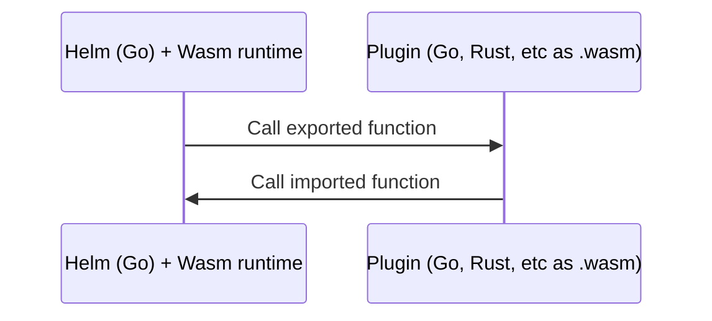

## Abstract

Helm is currently a monolithic application that is difficult to customize without changing the core codebase. This requires maintainers to review and accept every contribution, which is time-consuming and not scalable.

This architectural proposal outlines a concrete plan to define a wider range of plugin types in Helm 4, so that users will be able to customize more default functionality in their own environment through alternative plugins. This will be accomplished through a new Wasm based plugin system.

This will result in making Helm not only more extensible, but also more maintainable, allowing contributors to extend more of Helm's functionality via plugins rather than core changes to meet their needs more quickly.

## Scope

This HIP will cover the overall vision for the new plugin system, and an [implementation plan](#Implementation-Plan) for initial plugin types introduced into this system. This will will allow more categories of Helm functionality to become extended through additional plugin types in the future.

This HIP focuses primarily on CLI users.
SDK users will not be required to use Wasm plugin functionality—it is expected that they may instead prefer to directly include Go libraries exposed by authors of those plugins.
Additionally, this HIP does not address an idea raised to allow chart authors to define required plugins for a chart—that will be proposed in a follow-up HIP.

## Motivation

Helm CLI users want to extend and modify Helm's default behaviors. This is evidenced by the [massive number of new feature pull requests](https://github.com/helm/helm/pulls) to Helm core.

Helm 3 made some distance in addressing this issue through basic CLI plugins and other extensibility mechanisms, but these did not adequately address the end user need for customizing Helm's default behavior.

### Helm 3 plugins did not adequately address the problem this HIP solves

Helm 3 plugins were limited to primarily CLI subcommand plugins, and apart from downloader plugins, the plugin system was not designed to extend other categories of Helm functionality.

The [high-level goal](https://helm.sh/docs/topics/plugins/#an-overview) of the Helm 3 plugin system shows that plugins were intended to solve this problem:
> Helm plugins are add-on tools that integrate seamlessly with Helm. They provide a way to extend the core feature set of Helm, but without requiring every new feature to be written in Go and added to the core tool (and maintained by core Helm maintainers)

However, Helm 3 plugins had the following limitations:

- Because plugins are primarily intended to add new Helm CLI subcommands, the Helm 3 plugin architecure is not helpful for SDK users, nor Chart Authors, or for customizing the existing Helm core functionality.
- Helm 3 plugins call a user-specified arbitrary binary through a subprocess, which does not allow Helm to limit the scope of these commands (see Wasm sandboxing under [Security implications](#Security-implications) for how this will be resolved). Plugin maintainers must also be concerned about OS and architecture compatbility of pre-built binaries and scripts.
- There is only one specialized type of Helm 3 plugin—**downloader plugins**—which comes closest to what Helm 4 is modeling its new plugin types after. Downloader plugins are called by Helm for a specific purpose and have a well-defined scope. The main limitation here is that it does not allow users to modify other default behaviors of Helm.

### Other Helm 3 customization options did not adequately address the problem this HIP solves either

Apart from plugins, Helm 3 attempts to allow user customization globally and per command:

- Globally: By overriding Helm environment variables that allow certain configurations, such as setting the backend storage driver (`HELM_DRIVER`) or the Bearer KubeToken used for authentication (`HELM_KUBETOKEN`). These can be found by running `helm --help` or in the [`helm` command documentation](https://helm.sh/docs/helm/helm/#synopsis).
- Per command: By setting CLI flags and the equivalent SDK function options. This is the primary way Helm 3 allows user-defined configuration. It's important to note that command flags have proliferated over time in order to support backwards-compatibility within each previous MAJOR version of Helm. In addition to the high volume of open issues and PRs, these flags are clear evidence of the massive need for user-defined customization of Helm.

While useful, all of these configuration approaches are limited and do not provide the level of extensibility users have requested without requiring their use cases to be built into Helm core.

## Specification

This section outlines the Wasm based plugin system, and the plan to define a wider range of plugin types.

### Terminology

- #### Plugin System
    The *entire* Helm 4 plugin architecture.
- #### ApiVersion
    The version of the Plugin System (eg `v1`, `v2`). This lets us make large updates within the same MAJOR version of Helm.
- #### Plugin Engine
    A specific execution environment within the plugin system. Examples: `wasm`, `subprocess`, future engines.
- #### Plugin Type
    What the plugin *does*. Examples: `subcommand`, `downloader`, `render`, `postrender`
- #### Plugins
    The individual extensions users may optionallly install. Each specifies:
    * The `Plugin Type` (its job)
    * The `Plugin Engine` (its runtime/engine)

### Directory Structure and Go Packages

```text
pkg
└── plugin
    ├── internal
    │   ├── v1
    │   └── v2
    │       ├── subprocess
    │       └── wasm
    └── *.go
```

### Plugin System specification

The [Plugin System](#plugin-system) is versioned becasue in order to not break Helm 3 plugins in Helm 4, while allowing the project to deprecate old versions and make future changes in a sane way.

* `v1`: Legacy support for Helm 3 plugins; no new fields expected (deprecated in Helm 4, to be removed in Helm 5)
* `v2`: Modern plugins; requires specifying the new Plugin Engines (Wasm, Subprocess, etc.)
* `pkg/plugin/*.go`: Public functions containing logic for plugin installation, pulling plugin metadata, plugin listing, the routing layer that decides which internal engine (wasm, subprocess, etc) to use, and the [Plugin Type](#plugin-type) definitions.

### Plugin Engine specification

`v2` Plugin Engines will follow shared interfaces that define Plugin Types and cross-engine functionality.

### Plugin Types specification

These are optional plugins that can be used to alter the default behavior of Helm. Some plugin types will support multiple plugins of the same type to extend behavior (for example, multiple download plugins to support different protocols used across multiple dependencies of the same chart), while others may support using a single plugin to replace certain default behavior outright.

Initial plugins will be launched with the release of the new Plugin System, with the architecture making it now easier to achieve the longer-term goal of developing a wider range of plugin types. The initial plugin types will be:

- **Download**

    For downloading a chart or subchart from a remote source using some other protocol than HTTP/S or OCI, such as [s3](https://artifacthub.io/packages/helm-plugin/s3/s3) or [git](https://artifacthub.io/packages/helm-plugin/git/helm-git).
- **Postrender**

    The [Helm 3 post-renderer](https://helm.sh/docs/topics/advanced/#post-rendering) functionality moved to the new Wasm plugin system. See [Security implications](#Security-implications) section.
- **CLI**

    The new plugin system will continue to allow users to build and install CLI plugins, which specify subcommands for the Helm CLI. However, these will also be run in Wasm sandbox rather than directly calling arbitrary executables as a subprocess as was done in Helm 3. This will require Helm 4 plugin developers to follow our tutorials for migrating their legacy CLI plugin to the new Wasm CLI plugin framework.

### Plugin specification

`plugin.yaml` will be updated to include additional fields. These will be global across all plugins, with the exception of `config` which will vary depending on the plugin type.

```yaml
apiVersion: v1
name: my-custom-render-plugin
version: 0.1.0
type: render.plugins.helm.sh/v1
engine: extism/v1
sourceURL: https://github.com/example/my-plugin
config: {}
```

New fields:
- `apiVersion`: added to specify compatibility with the overall [Plugins System](#plugin-system) API. This will allow us to move to a new major version of Extism or other Wasm tooling independent of Helm major version.
- `engine`: ⚠️ added to specify the [Plugin Engine](#plugin-engine) the the plugin is compatible with.
- `type`: added to specify the Plugin Type message schema version the plugin expects to handle. Versioning this allows it to be updated within the same MAJOR version of Helm. The proposed format is `PLUGIN_TYPE.plugins.helm.sh/PLUGIN_TYPE_VERSION`.
- `sourceURL`: added to encourage best security practices. See [Security implications](#Security-implications).
- `config`: Per-plugin configuration allowable by it's [Plugin Type](#plugin-type) definition.

### Helm plugin commands specification

- `helm plugin list` command will be updated to also show the type of plugin, whether or not it is core or custom, the plugin source, and signing key if any. Example output:

    ```console
    NAME        VERSION     TYPE            SIGNED
    s3          1.2.3       download        862HB19B
    yamlscript  4.0.0       render          208DD36E
    cue         0.2.0       render          774UR67F
    kustomize   4.0.0       post-render     208DD36E
    my-bash     0.1.0       post-render     N/A

    -o wide

    SOURCE
    gitlab.com/someone/s3-helm-plugin
    github.com/helm/helm
    github.com/someone/cue-helm-plugin
    github.com/helm/helm
    local-dev
    ```
- `helm plugin install` will now install the latest release from a VCS repo URL, if a release version is not specified with `--version`
- `helm plugin update` will check for updates, then follow the same behavior of `plugin install`
- `helm plugin sign` will use Helm 4's built-in provenance signing mechanisms as a convenience to sign a plugin
- `helm plugin verify` will use Helm 4's built-in provenance mechanisms as a conveniencce to verify a signed plugin
- `helm plugin create` will add create a boilerplate plugin scaffolding, specified by `--type`. `--help` will list the types of plugins supported by your installed version of Helm

### Distribution specification

Helm will need to install/download plugins Wasm binaries. When users run `helm plugin install`, and other future methods.

Helm will initially support installing plugins from http URLs, from version control systems, and the local filesystem, just as in Helm 3.

The distribution format may either be discrete files (ie. filesystem or version control system), or packed tar archives (e.g. filesystem and URLs). Format described below.

Eventually, it is recommended that Helm supports plugin distribution via OCI artifacts. And further distribtion schemes e.g. S3 could be supported via plugins themselves.

#### Plugin distribution format

A plugin comprises of the following filesystem structure (or a tar archive of):

```
.
├── [LICENSE]        # Optional: plugin licence
├── NAME.wasm        # Wasm binary
└── plugin.yaml      # Plugin manifest
```

### Provenance specification

Helm will require plugins to be signed, producing an error if an unsigned plugin is attempted to be installed. With an exception for the following situation:

- Installing from the local filesystem (for local development)
- When the user provides an `--allow-insecure-plugins` flag (see [Security implications](#Security-implications))

Helm 4 will support the same provenance functionality for Plugins as Helm 3 supports for charts. See <https://helm.sh/docs/topics/provenance/>. When Helm supports additional signing mechanisms such as [sigstore](https://www.sigstore.dev/) based signing for charts, this will also be supported for plugins. To follow this initiative, see [Support additional signing mechanisms than PGP](https://github.com/helm/community/issues/325).

## Rationale

The following apply to the Plugin API v1 (see `apiVersion` under [Plugin specification](#plugin-specification)):

### Technical reasoning for Wasm plugins

For a plugin system to work, Helm must be able to "invoke" the plugin with a suitable message so that the plugin can perform its operation and return a result. The traditional "[foreign function interface](https://en.wikipedia.org/wiki/Foreign_function_interface)" problem



For this, Helm 4 will be using 2 of the 3 main technologies that exist for interfacing with Wasm modules/components today (the 3rd option—WASI P2—is under [Rejected ideas](#Rejected-ideas)). The two that will be used here are:

1. Native WASI P1 (POSIX/C-life FFI)
[WASI P1](https://wasi.dev) defines a way for a module to export basic types in a C/POSIX style FFI. While simple, the caller has to manage much of the details, like converting internal structures into simple types (integers, pointers) and (manually) managing memory.
2. Message serialization/RPC (GRPC/protobuf, JSON, etc)
Rather than trying to implement a rich FFI, either directly via WASI P1, or indirectly via WIT. Implement/utilize a simple FFI that uses a higher level serialization ie. serialization of internal types into e.g. protobufs or JSON and utilizing e.g. a simple FFI or GRPC or HTTP for the majority of message content.

### Technical reasoning using Extism for Wasm plugins

For Wasm Plugin Interfacing, Helm 4 will be leveraging the Extism project. See <https://extism.org/> and specifically the Extism [Go SDK](https://github.com/extism/go-sdk) and [Go PDK](https://github.com/extism/go-pdk).

Extism is the most mature and well-supported Wasm plugin system today, has a large and growing ecosystem of supported languages and libraries,  is actively maintained by a team of core contributors with a solid backwards compatibility policy, has a strong security focus, and makes Wasm plugin interfacing easier to implement than other systems.

By chosing Extism, the new [XTP Bindgen](https://github.com/dylibso/xtp-bindgen) convenience tool will also be available for polyglot plugin developers to create bindings and codegen for their Extism Wasm host functions. See [additional information here](https://github.com/extism/go-pdk?tab=readme-ov-file#generating-bindings).

## Backwards compatibility

Requirements for the new plugin system and the initial default plugins:

- Helm 4 MUST continue to be as easy to install as Helm 3
- The default installation for Helm 4 MUST be "batteries-included". I.e., users will not need to take any additional installation steps for the new plugin system in order to use Helm's default functionality out of the box
- Any plugins that affect Chart [apiVersion](https://helm.sh/docs/topics/charts/#the-chartyaml-file) 2 functionality MUST follow the same guidelines to preserve functional backwards compatibility for existing Chart API v2 charts as outlined in the backwards compatibility section of [hip-0020: H4HIP: Charts v3 Enablement](./hip-0020.md#backwards-compatibility)
- Plugins used by Helm MUST be explicitly chosen by the end-user, and be clearly discoverable by the end user that they will be in use. This is to follow the [principle of least astonishment](https://en.wikipedia.org/wiki/Principle_of_least_astonishment) and make it easier for maintiners to support end users who may not be aware they or someone else has chosen to not use a certain portion of Helm's default behavior in their environment.
- The new plugin system MUST NOT prevent SDK users from using the default functionality
- A security plan approved by Helm's security team MUST be adopted for developing and releasing this new architecture model

## Security implications

Summary:

The new plugins sytem will be based on Wasm for improved security over the previous subprocess plugin model in Helm 3, and for improved call and response options that allow extending more of Helm's functionality with plugins than was previously feasible. 

Additional steps are also taken to improve security:
- The plugin manifest (`plugin.yaml`) will now clearly identify the source code
- Tools are added for signing and verifying plugins
- Plugin authors are encouraged to follow best security practices (Helm will surface when these are not followed), and users are encouraged to take advantage of these
- Helm will automaitcally attempt to verify the provenance signature of a plugin by default when it is first installed
- [Helm 3 post-renderers](https://helm.sh/docs/topics/advanced/#post-rendering) will now also become a plugin type in the new Wasm plugin system

Details:

In Helm 3, plugins required users to opt-in before using by manually installing. This put the responsibility on the user to ensure they trust the plugin authors, and verify by inspecting the source code. These plugins did not have a built-in provenance mechanism for signing or verifying as charts do. Since these plugins could call any executable, users could be spoofed by inspecting the source code in VCS, while the plugin called a compiled binary built from a different source. Security-minded users could address this if they wish by downloading the source and compiling themselves rather than using the upstream compiled Wasm file. This was also the case with Helm 3 post-renderers, which required passing the binary path.

In Helm 4, users may still manually install plugins.

Helm 4 will address this in the following ways:

- Adds provenance signing and verifying options for plugins:

    Additionally, Helm 4 has built-in plugin provenance signing and verifying capability both through the CLI and SDK. This will make use of the same functionality for provenance that is supported for charts in Helm 4 (adding any additional methods like sigstore/cosign will be a separate HIP).

- Adds source URL:

    Helm 4 plugins `plugin.yaml` also adds a `sourceURL` key.

    This is to encourage plugin authors to list their plugin source code URL. 
    
- Security best practices encouraged and surfaced to end users:
    
    Plugin authors are expected to sign the plugins, clearly list their signing key(s) in the source code README, and give clear Wasm build instructions for their source code.

    For plugins that follow the above recommendations, end users are strongly encouraged to verify the provenance signature. Users may also inspect the source code before using plugins, and if they wish may build the Wasm plugin themselves.
    
    When a plugin is first installed using `plugin install` the CLI will exit with an informative error if a plugin is unsigned, and the user has not explicitly passed a flag (eg, `--allow-insecure-plugins`) to bypass this. Plugins installed from the local filesystem (from source as opposed to a tarball) are excepted from signing requirements, to enable local plugin devlopment.

    Assuming the plugin is signed (and not bypassed with the `--allow-insecure-plugins` flag), Helm will also attempt to verify the provenance signature BY DEFAULT when the plugin is first installed. If the signature is not found, or the signature is invalid, the user will be notified and the plugin will not be loaded. A user may pass a flag to bypass this verification check with an insecure flag too, but must explicitly do this to acknowledge they are bypassing the verification check.

## Implementation Plan

Work for the plugin system will follow the [H4HIP: Helm 4 Development Process](https://github.com/helm/community/blob/main/hips/hip-0012.md) timelines.

1. Marking this HIP as accepted (including security plan in this HIP approved by Helm's security team)
1. May. 2025: Engineering on this feature begins
1. Aug. 2025: Have inital work on all features included in the initial implementation, adhering to Feature freeze for Helm 4 release preparation
1. Nov. 2025: Initial offering feature complete by Helm v4.0.0 release
1. Post-release: Follow up HIPs for additional plugin types and features will match future Helm 4 Minor version release schedule

### Initial release of the new plugin system

- [ ] Create v1 of new plugin package to load Wasm Extism plugins
- [ ] Create message schemas for new plugins types:
    - [ ] `download.plugins.helm.sh/v1`
    - [ ] `render.plugins.helm.sh/v1`
    - [ ] `postrender.plugins.helm.sh/v1`
    - [ ] `cli.plugins.helm.sh/v1`
- [ ] Write host functions to invoke these initial defined Wasm plugin types

### Roadmap items that may be added in further HIPs

- Additional plugin types for moving other Helm functionality to the plugin system
- Allow plugins to be stored as OCI artifacts (in addition to HTTP, VCS, and local filesystem)
    - add Helm CLI command for plugins similar to `helm push`
- Add new Helm plugin types to ArtifactHub.io
    - Move current Helm plugin kind to legacy and add a new Helm plugin artifact kind.
      To not pollute too much the list of top level kinds supported on ArtifactHub, plugins subtype (downloader, render, etc) could be a property of the plugin entry. This would also have the benefit of allowing publishers mixing plugins of multiple subtypes in the same Artifact Hub plugins catalog/repository. Regarding the plugins catalog structure, ideally ArtifactHub maintainers would like them to follow the same format they're using for most artifacts kinds supported these days. Here is an example: https://artifacthub.io/docs/topics/repositories/kubewarden-policies/. Reusing the same catalog format across artifacts kinds creates a unified experience for publishers when listing their content on Artifact Hub. It also simplifies maintenance on their side (they support +25 artifact kinds), making the project more sustainable.

## How to teach this

- Create examples of each Plugin Type for the new plugin system that contributors can use as a model for their own plugins
    - `download`: OCI, HTTP/S
    - `render`: Gotemplate
    - `postrender`: No default. We should write a very simple example to prove that the host function works
    - `cli`: No default. Similarly we should write a simple example proving the host function works
- Write concise and easy to follow documentation for the new plugin system
- Write a blog post outlining how the community will benefit from the new plugin system, which can link to the documentation and these examples
- Create a presentation to propose for conference talks as another communition channel to make the community aware of the new plugin system
- Reach out to authors of community plugin to encourage them to update to the new plugin types (examples could be moving the [s3 downloader plugin](https://artifacthub.io/packages/helm-plugin/s3/s3) to the new `download` type, and the [Helm Diff plugin](https://artifacthub.io/packages/helm-plugin/diff/helm-diff) to the new `cli` type)

## Reference implementation

Two example Wasm plugins leveraging Extism have been prototyped. The first is an example downloader plugin, and the second is an example renderer plugin:
- https://github.com/gjenkins8/helm-plugin-ocigetter
- https://github.com/gjenkins8/helm-plugin-gotemplate-renderer/

The host functions are prototyped using Go testing, in `/testdriver/main_test.go` in each Git repo. These are fairly basic to start, but proves out that this capability works. Creating the proper interfaces will be part of the work implementing this HIP (see [Implementation Plan](#Implementation-Plan)).

## Rejected ideas

<!-- 1. ⚠️ Helm 4 will not continue to support the Helm 3 subprocess plugin model in Helm 4, which was used for both CLI plugins and downloader plugins.

    This would have allowed us to avoid the need to write a migration path for existing CLI plugins, but is not as secure as the new Wasm plugin model that has since become feasible.

    For these reasons, we've also ruled out other available subprocess-based plugin systems such as [Hashcorp's go-plugin package](https://github.com/hashicorp/go-plugin). -->

1. Helm 4 will not create a central repository for plugins.

    This is a non-starter for the Helm project. Helm maintainers have learned from the experience of the formerly centralized charts repo that it does not scale well or enable eccosystem growth as much as a distributed community-managed model. See <https://github.com/helm/community/blob/main/hips/archives/helm/distributed-search.md>.

1. Helm 4 have ruled out the following technologies for plugin interfacing in Helm 4:
    - [WASI Preview 2](https://github.com/WebAssembly/WASI/tree/main/wasip2#readme) / [WIT IDL](https://github.com/WebAssembly/component-model/blob/main/design/mvp/WIT.md) / [Wasm Component Model](https://github.com/webassembly/component-model)

        Problem: While it is production ready and in use by other projects, it is not yet supported by Extism's underlying Go tooling, Wazero. Without tooling like Extism, implementing the plugin model we're after would be a lot of additional work. It is likely that Wazero and therefore also Extism will support the Component model in time for Helm 5.

        The only other viable Component model alternative to Extism for our use case that we're aware of would be to use CGo to link in [Wasmtime](https://github.com/BytecodeAlliance/wasmtime), but that would likely require a high level of expertise to implement and maintain.

    - [Wazero](https://github.com/tetratelabs/wazero) directly
    
        Problem: With Wazero, all params are uint32, so any strings must be interpreted from that, which would be a significant amount of work to manage directly. This is one of the problems Extism solves, and is able to leverage Wazero in a viable way for our plugins use case.

    - [Wadge](https://wasmcloud.com/docs/developer/languages/go/components#wadge) in wasmCloud
    
        Problem: This is another CGo-based solution. Helm maintainers would like to avoid CGo due to complexity it would add for cross-compiling, debugging, and other issues.

    - [Web Assembly for Proxies (Go SDK)](https://github.com/proxy-wasm/proxy-wasm-go-sdk)
    
        Problem: This is largely Envoy-specific, used for their [Wasm HTTP filter plugin](https://www.envoyproxy.io/docs/envoy/latest/configuration/http/http_filters/wasm_filter), and does suit our use case well.

    - [Go native plugin system](https://pkg.go.dev/plugin)
    
        Problem: Go native plugins do not support Windows. For this reason alone, Helm can't use this solution. Additionally, go native plugins run as native code without any sandboxing restrictions.

    - [Embedded go interpreter (yaegi)](https://github.com/traefik/yaegi)

        Problem: Yaegi does not have full sandboxing like Wasm. See <https://github.com/traefik/yaegi/discussions/1463>

        Note: Traefik uses this, so it seemed notable enough to mention.

## Open issues

1. Should Helm 4 continue to support the Helm 3 subprocess plugin model, for CLI plugins?

    The issue is that subprocess plugins can do ANYTHING. We know one thing some Helm 3 plugins require is filesystem write access. Would it be acceptable to support only Wasm plugins if we allow the option for CLI Wasm plugins to write to only a specified, known filesystem path?

## References

Precedents:

Helm [2.1.0](https://v2.helm.sh/docs/plugins/#downloader-plugins) introduced the Helm plugin concept, mainly as a way to add additinal helm CLI subcommands that are not part of the built-in Helm codebase. This is helpful for adding new one-off functions, but does not allow users to extend the default behavior of Helm.

Later Helm [2.4.0](https://v2.helm.sh/docs/plugins/#downloader-plugins) introduced the downloader plugin, which did make Helm core functionality extensible—in this case allowing users to download a chart from other sources than HTTP/S repos by specifying any other protocols such as [s3](https://artifacthub.io/packages/helm-plugin/s3/s3) or [git](https://artifacthub.io/packages/helm-plugin/git/helm-git).
