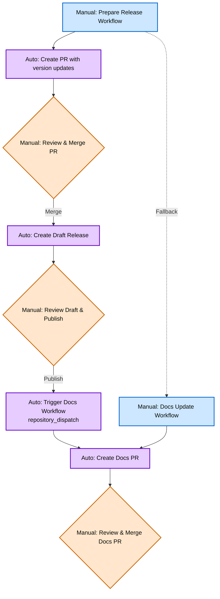

## Abstract

This HIP proposes automating the Helm release process through GitHub Actions while maintaining human review gates. The automation transforms the current 11-step manual checklist into a three-click process: trigger preparation, publish draft, merge docs PR. All changes flow through pull request reviews, preserving security while eliminating repetitive tasks.

## Motivation

The current 11-step [Release Checklist](https://github.com/helm/helm-www/blob/main/content/en/docs/community/release_checklist.md) requires manual coordination across helm/helm and helm/helm-www repositories, leading to human error, time consumption, and documentation delays. This automation preserves human judgment while eliminating repetitive tasks.

## Design Principles

- **Human Review Gates**: All changes require PR approval before implementation
- **Draft Releases**: Created for review before triggering documentation updates
- **Security Preserved**: Maintains signed commits and GPG signatures
- **Fallback Ready**: Manual process remains fully functional

## Automation Flow

### Workflow Process



### User Experience

**Step 1**: Maintainer triggers "Prepare Release" workflow with target version (e.g., `v3.20.0`), creating a PR with version updates.


**Step 2**: After PR merge, automation creates persistent release branch, signed tag, and **draft release** for review.

**Step 3**: Maintainer publishes draft, automatically triggering docs workflow to create website update PR.

**Fallback**: If automated docs trigger fails, maintainer can manually run "Update Docs" workflow in helm-www repository.

**Result**: 11-step manual checklist becomes a three-click process with full human review gates and automatic fallbacks.

### Example Implementation Repos

Working examples demonstrating the complete automation:
- [Example Source Repository](https://github.com/scottrigby/example-actions-autorelease-source) - Demonstrates helm/helm automation
- [Example Docs Repository](https://github.com/scottrigby/example-actions-autorelease-docs) - Demonstrates helm/helm-www automation

Example completion status:
- [x] Cross-repository automation via repository_dispatch
- [x] Draft release creation with human review gates
- [x] Persistent release branches for patch releases
- [x] Dynamic documentation updates with version/date tracking
- [x] Manual fallback workflows
- [ ] GPG signing of release artifacts
- [ ] Kubernetes version skew calculation from go.mod
- [ ] GitHub milestone management
- [ ] Release artifact attachment

### File Structure

```
helm/helm/
├── .github/workflows/
│   ├── prepare-release.yml      # Manual trigger, creates PR with version updates
│   ├── trigger-release.yml      # Auto trigger on PR merge
│   └── create-release.yml       # Creates release branch, tag, and draft release
└── scripts/
    ├── update-version.sh        # Updates version strings in code and test files
    └── generate-release-notes.sh # Release notes template from git history

helm/helm-www/
└── .github/workflows/
    ├── update-version.yml       # Creates PR to update website configuration
    └── manual-update-docs.yml   # Manual fallback for docs updates
```

**Key mechanisms:**
- Cross-repository communication via `repository_dispatch` events
- Draft releases created for human review before docs automation triggers
- Persistent release branches for patch release support
- All changes flow through pull request reviews

## Security & Compatibility

**Backwards Compatibility**: Manual process remains fully functional as fallback. No changes to existing release artifacts or tooling.

**Security**: All releases created in draft mode requiring manual publication. GPG signing and commit signing preserved. Cross-repo access via fine-grained Personal Access Token with minimal permissions.
