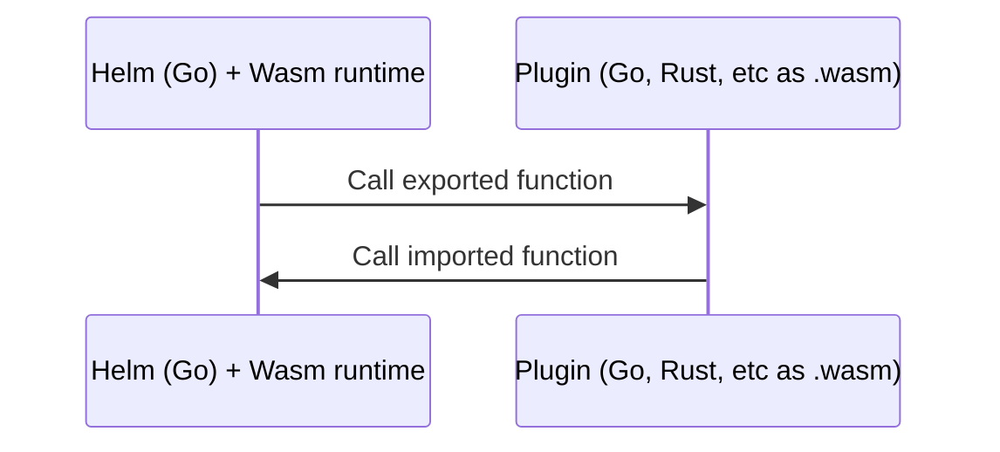

## Glossary

WIP

- **Legacy CLI plugins**: these are the traditional subprocess plugins that Helm 3 would call as user-specified binaries, and which would extend the Helm CLI as new subcommands.
- **Helm 4 default plugins**: these are of 2 kinds: Chart API v2 and Chart API v3 the default plugins. These should be bundled with Helm 4 so that chart API v2 charts still function exactly like they did in Helm 3.

## High level description of proposed architecture

### Vision
- move to a smaller Helm core, offloading functionality to default plugins, which can be either swapped out or extended with additional plugins to support advanced use cases

### Goals
- define different types of plugins for each part of existing Helm functionality (we could summarize all in-scope Helm functionality as fitting into different phases of the Helm packaging and release lifecycle)
- ultimately move as much existing functionality/code as possible out of Helm core into default plugins
    - this will allow us to more clearly define the core value proposition of Helm
    - and will let users modify nearly all Helm functionality except that core value proposition
    - will make helm core more maintainable, and allow plugins to have their own release lifecycle independent of Helm core (eg., http repo downloader plugin can freeze all new features after X date, and supports bug and security fixes for 1 year after Helm is released, sunset on Y date, etc)
    - will support an ecosystem of Helm extension plugin/extension developers, and allow the community of contributors to continue to grow to support end user needs without requiring expanding Helm core
- improve the security model of existing Helm 3 plugin architecture (now that Wasm is available for sandboxing, and to clearly define scope a plugin of each type can act upon, etc. And now that Extism and XTP are available to make plugin creation, object modeling, and language binding generation more achievable)

### Requirements
- preserve Helm 3 functional backwards-compatibility for Chart API v2 using default plugins, while allowing advanced users to alter that functionality
- ensure the user installation experience remains as seamless as in Helm 3
- ensure the proposed architecure works for SDK as well as CLI users
- adopt a solid security plan around developing and releasing this new architecture model

## Abstract

<!--A short (~200 word) description of the technical issue being addressed.-->

Helm 4 introduces an expanded plugin system, evolving from Helm 3.

Helm 3 users want to do many things, that currently require functionality to be built into Helm's codebase. This is a slow process, and must be thoroughly vetted by Helm maintainers to adopt into Helm core. This also increases the size of the codebase, and increases complexity, all of which must be maintained.

The result is very long release cycle for major changes in Helm, limited configurability and extensibility of existing functionality, difficulty for Helm maintainers to keep up with user requsts and code contribution for adding additional or configurable functionality to the core project, and frustrated users who often must abandon Helm for custom tooling, rely on custom forks, or adopt kludgy workarounds.

To address these problems on a design level, Helm 4 proposes a Wasm based, plugin-first architecture that will allow developers to customize and extend Helm’s core functionality at key phases of the packaging and release lifecycle. Helm 4 plugins will build upon the Helm 3 downloader plugin model, expanding the number of additional plugin types available. This will allow users to customize or extend nearly all default Helm functionality. By distributing functionality across plugins, Helm can also remain modular and lightweight, while enabling additional advanced use cases.

To support this transition, Helm 4 must address the challenges inherent with plugin distribution while ensuring the user installation experience remains as seamless as in Helm 3. It's also important to ensure the proposed architecture works for SDK as well as CLI users.

## Motivation

<!--Clearly explain why the existing design is inadequate to address the problem that the HIP solves.-->

### Why Helm 3 plugins were inadequate to address the problem this HIP solves

<!-- The existing design of Helm 3 plugins is inadequate to address the problem that the HIP solves. -->

This high-level goal of Helm 3 plugins will remain the same for Helm 4 plugins:
> Helm plugins are add-on tools that integrate seamlessly with Helm. They provide a way to extend the core feature set of Helm, but without requiring every new feature to be written in Go and added to the core tool (and maintained by core Helm maintainers)

However, the Helm 3 plugin system has the following limitations:

- Because plugins are primarily intended to add new Helm CLI subcommands, the Helm 3 plugin architecure is not helpful for SDK users or for customizing the existing Helm core functionality.
- Helm 3 plugins shells out to a user-specified arbitrary binary, which does not allow Helm to limit the scope of these commands.
Note that the primary value proposistion of allowing users to run these binaries as Helm subcommands rather than independently is that Helm-related context is passed, which saves the subcommand binary additional work of fetching that information if it is needed.
- Note that one specialized type of Helm 3 plugin—**downloader plugins**—comes closest to what Helm 4 is modeling its new plugin types after. Downloader plugins are called by Helm for a specific purpose and have a well-defined scope.

### Why other customization options were inadequate to address the problem this HIP solves

Apart from plugins, Helm 3 attempts to allow user customization both globally, and per chart:

- Globally: By overriding Helm environment variables that allow certain configurations, such as setting the backend storage driver (`HELM_DRIVER`) or the Bearer KubeToken used for authentication (`HELM_KUBETOKEN`). These can be found by running `helm --help` or in the [`helm` command documentation](https://helm.sh/docs/helm/helm/#synopsis).
- Per command: By setting CLI flags. This is the primary way Helm 3 allows user-defined configuration. It's important to note that these have proliferated over time in order to support backwards-compatibility within each previous MAJOR version of Helm. In addition to the high volume of open issues and PRs, these flags are clear evidence of the massive need for user-defined customization of Helm. Also by setting the equivalent SDK function options (all SDK functions must support the same configuration as flags since the SDK powers the CLI)
- Per chart: By defining Hook annotations in a chart's Kubernetes resources, which allow them to be triggered at specific lifecycle phases (e.g., pre-install, post-upgrade)

While useful, all of these configuration approaches are limited and do not provide the level of extensibility users have requested without requiring their use cases to be built into Helm core.

Helm 4 aims to address these limitations by implementing a robust plugin-based system that allows deeper lifecycle integration and modular extension.

To support this transition, Helm 4 must address the challenges of plugin distribution, ensuring the user installation experience remains as seamless as in Helm 3.

## Rationale

*Describe why particular design decisions were made.*

WIP

## Specification

*Describe the syntax and semantics of any new feature.*

### Chart-requied and user-specified plugins

Some plugin types would be optional, such as validation plugins or backend storage plugins, which are up to the discretion of the chart operator's use cases.

However, a subset of these plugin types would be required by a chart. Some examples are:
- render plugins (if a chart is written in YAMLScript of Pkl, these plugins are required to actually use the chart)
- downloader plugins—perhaps—for dependencies. If a dependent chart location is specified at, eg., `s3://` or `git://` then the user would need this plugin to install the chart.

Chart-required plugins may need to wait for Chart API v3. While Helm 3 currently **does** allow additional keys to be added to the Chart struct while retaining Go backwards-compatibility, any keys that add required functionality for a chart to install would not work with older versions of Helm (such as render plugins) and therefore a top level `plugins` key will need to wait for Chart API v3.

For discussion:
Chart API v3 spec for chart-required plugins. There are several plugin types that make sense to be chart-required.

`render` plugin type: While most charts would likely have one render engine, for certain use cases a chart could support multiple filetypes. For example, a chart could have a majority of gottemplate files with one YAMLScript file, among others. These could be identified by file type.

`downloader` plugin type: if dependencies are at locations requiring plugins that aren't helm default plugins, then they will need to be specified too.

```yaml
plugins:
    renderer:
        # made up URLs just for example
        - render.plugins.helm.sh/pkl@v1.0.0: [".pkl", ".pickle"]
        - render.plugins.helm.sh/ys@v2.1.1: [".ys"]
    downloader:
        - https://artifacthub.io/packages/helm-plugin/s3/s3@0.16.3: ["s3"]
        - https://artifacthub.io/packages/helm-plugin/git/helm-git: ["git", "git+https", "git+ssh", "git+file"]
```

### Work in progress

Recent discussions have highlighted the potential of using WebAssembly (Wasm) for plugin interfacing. Wasm provides a portable, secure, and efficient way to run plugin code across environments, aligning well with Helm’s modular goals. This approach was documented as part of a collaborative effort during KubeCon NA 2024. Prototyping a proof-of-concept is underway, with a goal of informing the final plugin architecture.

## Backwards compatibility

<!-- Describe potential impact and severity on pre-existing code. -->

To ease the transition from Helm 3 to Helm 4:
- Existing Helm functionality will continue to work with minimal changes.
- New plugin-based extensions will be optional but encouraged for advanced use cases.
- Helm 4 will include migration guides and tools to assist users.

While the Helm commands and SDK may differ, Chart API v2 charts MUST continue to work as-is (see [Requirements](#requirements) above). Therefore, with this new plugin-first architecture, default plugins (required for Chart API v2 charts to work as they did with Helm 3) must be available to Helm 4 users without needing to do additional work.

For discussion:
- The standard distribution of Helm come bundled with the default plugins for chart api v2 and v3
- Advanced users may optionally install Helm without the default plugins if they know they will not require them, for a more streamlined experience
- For SDK users:
    - Those who do not want to allow filesystem access, potentially Go's embed file functionality could be used for the default Wasm plugins. This is a valuable option to explore, especially as `embed.FS` would allow the code to tread either embedded plugins or plugins on disk in the same way. See <https://pkg.go.dev/embed>. This could also pair nicely with build tags for exclude/include a default plugins directory (eg., default vs contrib directory, etc).
    - If filesystem access is an option, but security is still a concern, the SDK user project could allow a specific filesystem location for Wasm plugins. The plugins could then be—at the discretion of the SDK users—either built into a container image, or user-mounted.

## Security implications

<!-- How could a malicious user take advantage of this new feature? -->

- Plugins will run in a sandboxed environment to mitigate security risks.
- Helm will provide guidelines for securely developing and distributing plugins.

Vetting plugins timeline:
1. During initial development, Helm will only work with plugins developed by and/or under the control of the Helm org until the interfaces are more fully established.
1. A process will be established to ensure secure discovery and distribution of plugins.
1. Once those are established, we will allow community plugins

TBD: Host functions

- Ideas on the above for **discussion**:
    - For community plugins (not under the Helm GitHub org), perhaps the Helm security team could vet and approve specific versions of a plugin (identified by the commit hash) to start. This is not ultimatly sccalable as a job for the Helm team
    - Require signing. Also require verifying of non-helm org (community) plugins. Then, the Helm team would need to vet and accept community author signing keys for trusted plugin authors? Or, perhaps skip this and go right to the next point:
    - Eventually, plugin consumers (end users) would need to explicitly accept the additional signing keys by non-helm authors.
    - Artifact Hub's verified and official labels could be used to communicate the status of default plugins. Perhaps, something like a "vetted" label could be added?

## Implementation Plan

1. **Explore Wasm Integration**: Evaluate Wasm runtime options and integrate Wasm support into the plugin framework.
1. **Create Working Protopype:** Prove the viability of this proposed architecture with an initial, functional prototype
1. **Build Plugin Framework**: Implement the core framework for plugin management and invocation.
1. **Define Plugin Interface and Types**: Develop standardized interface for plugin execution, and define the initial plugin types.
1. **Build Initial default Plugins:** Move Helm 3's Chart API v2 functionality into initial plugins, which will be the default for Chart API v2 charts. 
1. **Ensure Secure Distribution**: Establish a secure process for plugin discovery and distribution.
1. **Develop Documentation**: Publish comprehensive guides for users and plugin developers.

### Good candidates for initial plugins types to implement

- **Chart downloader plugins:**
ie, oci, s3, http-repo as default plugins (Helm 3 functionality). And others, optionally, such as s3, git, etc.
multiple could be used, for example, in dependency charts,
ie, parent chart from oci, child chart from http repo.
- **Validation plugins:**
For example, JSON Schema, CUE validation, CEL, kubeconform, etc.
- **Renderer plugins:**
Potentially more than one in a single chart? based on mime type, eg .yaml .pkl, .cue, etc
- **Ordering/sequencing plugins:**
The ability to specify the order of applying resources to the kubeapi. eg, depends_on between resources
- **Waiting/status plugins:**
For example, kstatus could be the default. Another plugin could add more robust options, like waiting for a custom situation to occur for a particular resource before another resource is applied (we realize this is not ideal, but there may be a need this for legacy applications, and could create a plugin for these use cases)
- **Post-renderer plugins:**
Post-render chart output YAML
- **Storage backend plugins:**
Location where Helm release metadata is stored. Currently, defaults to k8s secrets, but also could be a configmap (helm v2 compatibility), and SQL (Postgres). OCI Artifacts would be an example of a new option via a plugin.

## How to teach this

<!-- How to teach users, new and experienced, how to apply the HIP to their work. -->

WIP

- Concise documentation
- Blog posts and conference talks explaining how to take advantage of the new plugin system
- Example plugin templates

## Reference implementation

<!-- Link to any existing implementation and details about its state, e.g. proof-of-concept. -->

We will be using Wasm for Plugin Interfacing, leveraging the Extism project. See <https://extism.org/> and specifically the Extism [Go SDK](https://github.com/extism/go-sdk) and [Go PDK](https://github.com/extism/go-pdk).

We can also use the new XTP for bindings / codegen / host functions. See <https://github.com/extism/go-pdk?tab=readme-ov-file#generating-bindings>.
    - Note that we would still have responsibility to—through the host function—get the pointer. Then Extism makes it easy to readbytes, allocate memory etc. Ultimately, it makes it easy for a plugin implementer to write, but some work in the host function. And the folks at Dylibso are very happy to help us at that stage.
    
### Proof-of-concept
    
Two example Wasm plugins leveraging Extism have been prototyped. The first is an example downloader plugin, and the second is an example render plugin:
- https://github.com/gjenkins8/helm-plugin-ocigetter
- https://github.com/gjenkins8/helm-plugin-gotemplate-renderer/

The host functions are prototyped using Go testing, in `/testdriver/main_test.go` in each Git repo. These are fairly basic to start, but proves out that this capability works. Creating the proper interfaces will be part of the work implementing this HIP (see "[Implementation Plan](#implementation-plan)").

### Technical reasoning for Wasm plugins

For a plugin system to work, Helm must be able to “invoke” the plugin with a suitable message so that the plugin can perform its operation and return a result. The traditional "[foreign function interface](https://en.wikipedia.org/wiki/Foreign_function_interface)” problem



For this, we will be using 2 of the 3 main technologies that exist for interfacing with Wasm modules/components today (note the 3rd option—WIT/WASI Preview 2 (Wasm IDL)—is under rejected ideas at least until it reached further maturity):

- Native WASI P1 (POSIX/C-life FFI)
[WASI P1](https://wasi.dev) defines a way for a module to export basic types in a C/POSIX style FFI. While simple, the caller has to manage much of the details, like converting internal structures into simple types (integers, pointers) and (manually) managing memory.
- Message serialization/RPC (GRPC/protobuf, JSON, etc)
Rather than trying to implement a rich FFI, either directly via WASI P1, or indirectly via WIT. Implement/utilize a simple FFI that uses a higher level serialization ie. serialization of internal types into e.g. protobufs or JSON and utilizing e.g. a simple FFI or GRPC or HTTP for the majority of message content.

## Rejected ideas

*Why certain ideas that were brought while discussing this HIP were not ultimately pursued.*

WIP

### 🚫 A central repository for plugins

- A centralized repository for community plugins. We know from previous experience with the formerly centralized charts repo that it does not scale well or enable eccosystem growth as much as a distributed community-managed model. See <https://github.com/helm/community/blob/main/hips/archives/helm/distributed-search.md>.
- Go native plugin system https://pkg.go.dev/plugin. It does not support Windows

### 🚫 Non-Wasm plugins

1. OS/Arch distribution problems
2. Security concerns of non-sandboxed execution

These include:
- Go native plugin system
https://pkg.go.dev/plugin
    - downsides:
        - Does not support Windows. For this reason alone, we can't use it
        - The version of go, architecture, and (some other build options) MUST match between parent and plugin
        - WHEN helm core go version upgrades, none of the community plugins will work until the plugin maintainers upgrade their plugin to match the new helm core Go version
- Hashcorp's go-plugin package
https://github.com/hashicorp/go-plugin
    - this is also what protobuf does (subprocess)
- Embedded go interpreter
    - traefik does this (github.com/traefik/yaegi)
- Caddy novel Go plugin approach
https://caddyserver.com/docs/architecture

### 🚫 Non-Extism Wasm plugins

- wazero (directly)
https://github.com/tetratelabs/wazero
    - note that [extism/go-sdk](https://github.com/extism/go-sdk) (see Extism under [Reference implementation](#reference-implementation)) leverages wazero in a viable way.
    - downsides:
        - all params are uint32. So, any strings must be interpreted from that
or in our case, structs, must be converted in/out (may need to write a library for this?)
- Wadge in wasmCloud
https://wasmcloud.com/docs/developer/languages/go/components#wadge
    - Bailey Cosmonic CTO suggested (via Taylor Thomas)
    - downsides:
        - relies on CGO
- Envoy's Wasm approach
https://www.envoyproxy.io/docs/envoy/latest/configuration/http/http_filters/wasm_filter
- WIT/WASI Preview 2 (Wasm IDL)
    - WASI P2 defines WIT as a IDL for Wasm modules components, which greatly simplifies message parsing capabilities. However, as WASIP2 is (very) new, support is quite limited (unsupported in wazero for example).

## Open issues

*Any points that are still being decided/discussed.*

TBD

## Future Work

- Expanding plugin functionality to support additional lifecycle phases in addition to the "good candidates for initial plugins" above.
- Developing advanced tools for debugging and testing plugins.
- Investigate the need to create migration tools to help users transition from Helm 3 to the Helm 4 plugin-first architecture (or from Chart API v2 to v3). For prior work see the [helm-2to3 plugin](https://github.com/helm/helm-2to3).

## Acknowledgments

WIP

- Special thanks to the Helm community for their feedback and contributions to this proposal.
 
<!-- We can already say:-->
- Thanks to Extism and Wazero maintainers for guidance

<!-- Ideally we'll also be able to say:
- Thanks also to Fermyon, Cosmonic, and Dylibso for guidance and collaboration on Wasm integration in Helm.
-->

## References

*A collection of URLs or materials used as references through the HIP.*

TBD
