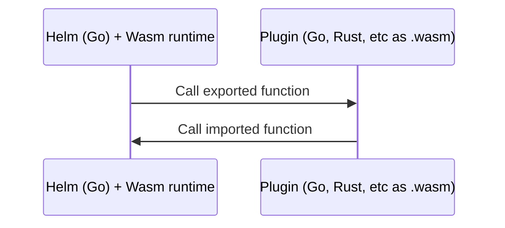

## Abstract

**A short (~200 word) description of the technical issue being addressed.**

Helm is currently a monolithic application that is difficult to customize without changing the core codebase. This requires maintainers to review and accept every contribution, which is time-consuming and not scalable.

This architectural proposal outlines a concrete plan to build a new Wasm plugin system and define a wider range of plugin types in Helm 4 to componentize as much default functionality as possible. Users will be able to customize the default functionality in their own environment through alternative plugins.

This will result in making Helm more maintainable and extensible, improve security through Wasm sandboxing, and allow contributors to extend Helm's functionality via plugins rather than core changes to meet their needs more quickly.

This HIP will cover the overall vision for the new plugin system, an [implementation plan](#Implementation-Plan) for initial plugin types introduced into this system, and examples for other possible categories of Helm functionality that could be extended into the new plugin sytem through additional plugin types in the future. This should not limit future plugin types, which can continue to be introduced as follow-up HIPs.


<!-- ### Detailed enefits of this new plugin system

1. The new plugin system will improve contributor experience by allowing a wider range of plugin types to extend more default functionality without requiring further changes to Helm core than was possible in Helm 3
2. Wasm plugins will be more secure than Helm 3 subprocess plugins
3. Helm core is more maintainable due to it being smaller and more focused. There will be fewer issues and pull requests for new features for maintainer reveiw, since those needs can now be met by writing plugins. And guidance and examples on writing plugins is more reusable maintainer work than than reviewing and problem-solving custom feature contributions within the core codebase
4. Helm contributor community and ecosystem will continue to grow as developers are unencumbered to support more end user needs through plugins—whether maintained privately or shared publicly
5. End-users will be less frustrated as plugin contributions can now be faster without a lengthy pull request process for Helm core, and also as these new features will no longer require maintainers to decide which are in or out of scope for Helm core -->

## Motivation

**Clearly explain why the existing design is inadequate to address the problem that the HIP solves.**

Users want to extend and modify Helm's default behaviors. This is evidenced by the [massive number of new feature pull requests](https://github.com/helm/helm/pulls) to Helm core. This extensibility need applies to chart users ([Application Operators](https://github.com/helm/community/blob/main/user-profiles.md#1-application-operator)), chart authors ([Application Distributors](https://github.com/helm/community/blob/main/user-profiles.md#2-application-distributor)), and SDK users ([Supporting Tool Developer](https://github.com/helm/community/blob/main/user-profiles.md#4-supporting-tool-developer)).

Helm 3 made some distance in addressing this issue through basic CLI plugins and other extensibility mechanisms, but these did not adequately address the end user need for customizing Helm's default behavior.

### Why Helm 3 plugins were inadequate to address the problem this HIP solves

Plugins were limited to primarily CLI plugins, and apart from downloader plugins, the plugin system was not designed to extend other categories of Helm functionality.

The [high-level goal](https://helm.sh/docs/topics/plugins/#an-overview) of the Helm 3 plugin system shows that plugins were intended to solve this problem:
> Helm plugins are add-on tools that integrate seamlessly with Helm. They provide a way to extend the core feature set of Helm, but without requiring every new feature to be written in Go and added to the core tool (and maintained by core Helm maintainers)

However, Helm 3 plugins had the following limitations:

- Because plugins are primarily intended to add new Helm CLI subcommands, the Helm 3 plugin architecure is not helpful for SDK users, nor Chart Authors, or for customizing the existing Helm core functionality.
- Helm 3 plugins call a user-specified arbitrary binary through a subprocess, which does not allow Helm to limit the scope of these commands (see Wasm sandboxing under [Security implications](#Security-implications) for how this will be resolved). Plugin maintainers must also be concerned about OS and architecture compatbility of pre-built binaries and scripts.
- There is only one specialized type of Helm 3 plugin—**downloader plugins**—which comes closest to what Helm 4 is modeling its new plugin types after. Downloader plugins are called by Helm for a specific purpose and have a well-defined scope. The main limitation here is that it does not allow users to modify other default behaviors of Helm.

### Why other customization options were inadequate to address the problem this HIP solves

Apart from plugins, Helm 3 attempts to allow user customization globally, per command, and per chart:

- Globally: By overriding Helm environment variables that allow certain configurations, such as setting the backend storage driver (`HELM_DRIVER`) or the Bearer KubeToken used for authentication (`HELM_KUBETOKEN`). These can be found by running `helm --help` or in the [`helm` command documentation](https://helm.sh/docs/helm/helm/#synopsis).
- Per command: By setting CLI flags and the equivalent SDK function options. This is the primary way Helm 3 allows user-defined configuration. It's important to note that command flags have proliferated over time in order to support backwards-compatibility within each previous MAJOR version of Helm. In addition to the high volume of open issues and PRs, these flags are clear evidence of the massive need for user-defined customization of Helm.
- Per chart: By defining Hook annotations in a chart's Kubernetes resources, Chart authors can trigger Kubernetes objects at specific lifecycle phases (e.g., pre-install, post-upgrade)

While useful, all of these configuration approaches are limited and do not provide the level of extensibility users have requested without requiring their use cases to be built into Helm core.

## Specification

*Describe the syntax and semantics of any new feature.*

Helm 4 will implement a Wasm plugin architecture that componentizes core Helm functionality into discrete, replaceable plugins. The ultimate goal is to move as much existing functionality/code as possible out of Helm core into default plugins.

### Four kinds of plugins

There will be four kinds of plugins in the new system: Default Behavior plugins, Alternative Behavior plugins, Chart-defined plugins, and CLI plugins.

#### 1. Default behavior plugins

These plugins will be used to implement the default behavior of Helm that can then be overridden by Alternative Behavior plugins. This includes all functionality for Chart API v2, non-chart-specific functionality for Chart API v3, and other Helm functionality not tied to a Chart ApiVersion. Because of this, these plugins will be automatically loaded into the default installation of Helm 4.

Like all other Helm 4 plugins, these will be written as Wasm plugins. However, while non-default plugins may be written in [any language supported by Extism PDK](https://extism.org/docs/concepts/pdk/), Default Behavior plugins will be written in Go (effective copied from existing Helm code), in order to keep Helm source codebase—core and default plugins—consistent and more maintainable than a polyglot codebase.

These plugins will also be useful as examples for community plugin developers wishing to write their own plugins.

Initial Default Behavior plugins:

- **Download** (for downloading a chart from a remote source using HTTP/S or OCI)

Additional default plugins may be created over time, as more code is moved from Helm core into plugins. For example, the go template chart renderer. 

#### 2. Alternative Behavior plugins

These are optional plugins that can be used to alter the default behavior of Helm. Some plugin types will support multiple plugins of that type to extend behavior (for example, multiple download plugins to support different protocols used across multiple dependencies of the same chart), while others may support using a single plugin to replace default behavior outright.

- **Download** (for downloading a chart or subchart from a remote source using some other protocol than HTTP/S or OCI such as [s3](https://artifacthub.io/packages/helm-plugin/s3/s3) or [git](https://artifacthub.io/packages/helm-plugin/git/helm-git))
- **Postrender** (the [Helm 3 post-renderer](https://helm.sh/docs/topics/advanced/#post-rendering) functionality moved to the new Wasm plugin system. See [Security implications](#Security-implications) section)

#### 3. Chart-defined plugins

Support for Chart-defined plugins will be added starting in Chart API v3. `Chart.yaml` will define a top-level `plugins` key, and `Chart.lock` capturing specific plugin versions and checksums.

For the initial release of the new plugin system, chart authors will be able to define custom plugins for the following categories:

- **Download** (to allow chart authors to specify plugins for downloading subcharts with different protocols than the default. See the `download` type under alternative behavior plugins)
- **Manifest render** (for rendering a chart's templates into a set of Kubernetes resources using some other engine than gotemplate)

After the initial plugin system release, the intention is to make it easy to continue adding new chart-defined plugin types to extend additional categories of non-default chart behavior as this becomes desirable. Some examples may be:

- Values schema validation (for validating the chart's `values.yaml` file using something other than JSON Schema)
- Dependency resolution (for using a different subchart dependency resolver than the one currently used by Helm)

To plan for forward compatibility, a `minimumHelmVersion` field may be added to allow future plugins to specify the minimum version of Helm that must be used for the chart (or since this is the version of Helm that introduced the new plugin, perhaps this can be auto-detected).

Note that Helm 3 allowed a similar forwards-compatibility for Chart API v2, for example when support for a new gotemplate/sprig function was added to a specific Helm version. Charts could check the Helm version in their template or a helper function, and exit with a friendly error if the version of Helm did not meet this version constraint. Helm 4 may be able to do better as this applies to plugins.

A first pass for Chart-defined plugin syntax in `Chart.yaml`:

```yaml
# made up example URLs—these are not actual Helm 4 plugins yet
plugins:
  - name: pkl
    type: plugins.helm.sh/render/v1
    url: https://github.com/pkl-community/helm-pkl
    version: 0.1.0
  - name: helmys
    type: plugins.helm.sh/render/v1
    url: https://github.com/kubeys/helmys
    version: 0.1.4
  - name: s3
    type: plugins.helm.sh/download/v1
    url: https://github.com/hypnoglow/helm-s3
    version: 0.16.3
  - name: git
    type: plugins.helm.sh/download/v1
    url: https://github.com/aslafy-z/helm-git
    version: 1.3.0
```

#### 4. CLI plugins

The new plugin system will continue to allow users to build and install CLI plugins, which specify subcommands for the Helm CLI. However, these will also be run in Wasm sandbox rather than directly calling arbitrary executables as a subprocess as was done in Helm 3. This will require Helm 4 plugin developers to follow our tutorials for migrating their legacy CLI plugin to the new Wasm CLI plugin framework.

### Helm plugin specification

`plugin.yaml` will be updated to include additional fields. Some will be global across all plugins, and others will vary depending on the plugin.

Global:

- `sourceURL` is added to encourage best security practices. See [Security implications](#Security-implications).
- `apiVersion` added to allow us to update the overall plugins system API, similar to Chart API version. This will allow us to move to a new major version of Extism or other Wasm tooling independent of Helm major version.
- `type` is added to specify the version of the API for the desired plugin type. This API defines the message scheme the plugin expects to handle, and versioning allows that to be updated within the same MAJOR version of Helm. The proposed format is `plugins.helm.sh/TYPE/VERSION`.

```yaml
name: my-custom-render-plugin # same as Helm 3
version: 0.1.0 # same as Helm 3
apiVersion: v1 # NEW: overall plugin system API version
type: plugins.helm.sh/render/v1 # NEW: v1 of the "render" plugin type
sourceURL: https://github.com/example/my-plugin # NEW
```

### Helm plugin commands

- `helm plugin list` command will be updated to also show the type of plugin, whether or not it is core or custom, the plugin source, and signing key if any. Example output:
    ```console
    NAME        VERSION     TYPE            KIND    
    oci         4.0.1       download        core
    http/s      4.0.0       download        core
    s3          1.2.3       download        custom
    gotemplate  4.0.0       render          core
    yamlscript  4.0.0       render          core
    cue         0.2.0       render          custom
    kustomize   4.0.0       post-render     core
    my-bash     0.1.0       post-render     custom

    -o wide

    SIGNED      SOURCE
    208DD36E    github.com/helm/helm
    208DD36E    github.com/helm/helm
    862HB19B    gitlab.com/someone/s3-helm-plugin
    208DD36E    github.com/helm/helm
    208DD36E    github.com/helm/helm
    774UR67F    github.com/someone/cue-helm-plugin
    208DD36E    github.com/helm/helm
    no          local-dev
    ```
- `helm plugin install` will now install the latest release from a VCS repo URL, if a release version is not specified with `--version`
- `helm plugin update` will check for updates, then follow the same behavior of `plugin install`
- `helm plugin sign` will use Helm 4's built-in provenance signing mechanisms as a convenience to sign a plugin
- `helm plugin verify` will use Helm 4's built-in provenance mechanisms as a conveniencce to verify a signed plugin
- `helm plugin create` will add create a boilerplate plugin scaffolding, specified by `--type`. `--help` will list the types of plugins supported by your installed version of Helm

Additionally commands will be added to allow packaging Chart-defined plugins within the chart (see [Distribution](#Distribution) for reasoning):

- `helm chart plugin build` similar to `helm dependency build` but for plugins
- `helm chart plugin update` similar to `helm dependency update` but for plugins

### Distribution

_THIS SECTION IN PROGRESS. See [Open issues](#Open-issues)_

Helm will need to install/download plugins Wasm binaries. When users run `helm plugin install`, or (eventually) when a chart requires plugins.

Helm will initially support installing plugins from http URLs, from version control systems, and the local filesystem, just as in Helm 3.

The distribution format may either be discrete files (ie. filesystem or version control system), or packed tar archives (e.g. filesystem and URLs). Format described below.

Eventually, it is recommended that Helm supports plugin distribution via OCI artifacts. And further distribtion schemes e.g. S3 could be supported via plugins themselves.

To enable airgapped installations and other use cases where downloading Chart-defined plugins is not feasible, plugins may be packaged and distributed with the chart itself, similar to how Helm 3 allows this for a chart's subchart dependencies. A command will be added to enable this (see [Helm plugin commands](#Helm-plugin-commands)).

#### Plugin distribution format

A plugin comprises of the following filesystem structure (or a tar archive of):

```
.
├── [LICENSE]        # Optional: plugin licence
├── NAME.wasm        # Wasm binary
└── plugin.yaml      # Plugin manifest
```

### Provenance

Helm will require plugins to be signed, producing an error if an unsigned plugin is attempted to be installed. With an exception for the following situation:

- Installing from the local filesystem (for local development)
- When the user provides an `--unsafe` flag (see [Security implications](#Security-implications))

Helm 4 will support the same provenance functionality for Plugins as Helm 3 supports for charts. See <https://helm.sh/docs/topics/provenance/>. When Helm supports additional signing mechanisms such as [sigstore](https://www.sigstore.dev/) based signing for charts, this will also be supported for plugins. To follow this initiative, see [Support additional signing mechanisms than PGP](https://github.com/helm/community/issues/325).

## Rationale

*Describe why particular design decisions were made.*

The following apply to the Plugin API v1 (see `apiVersion` under [Helm plugin specification](#Helm-plugin-specification)):

### Technical reasoning for Wasm plugins

For a plugin system to work, Helm must be able to “invoke” the plugin with a suitable message so that the plugin can perform its operation and return a result. The traditional "[foreign function interface](https://en.wikipedia.org/wiki/Foreign_function_interface)” problem



For this, Helm 4 will be using 2 of the 3 main technologies that exist for interfacing with Wasm modules/components today (the 3rd option—WASI P2—is under [Rejected ideas](#Rejected-ideas)). The two that will be used here are:

1. Native WASI P1 (POSIX/C-life FFI)
[WASI P1](https://wasi.dev) defines a way for a module to export basic types in a C/POSIX style FFI. While simple, the caller has to manage much of the details, like converting internal structures into simple types (integers, pointers) and (manually) managing memory.
2. Message serialization/RPC (GRPC/protobuf, JSON, etc)
Rather than trying to implement a rich FFI, either directly via WASI P1, or indirectly via WIT. Implement/utilize a simple FFI that uses a higher level serialization ie. serialization of internal types into e.g. protobufs or JSON and utilizing e.g. a simple FFI or GRPC or HTTP for the majority of message content.

### Technical reasoning using Extism for Wasm plugins

For Wasm Plugin Interfacing, Helm 4 will be leveraging the Extism project. See <https://extism.org/> and specifically the Extism [Go SDK](https://github.com/extism/go-sdk) and [Go PDK](https://github.com/extism/go-pdk).

Extism is the most mature and well-supported Wasm plugin system today, has a large and growing ecosystem of supported languages and libraries,  is actively maintained by a team of core contributors with a solid backwards compatibility policy, has a strong security focus, and makes Wasm plugin interfacing easier to implement than other systems.

By chosing Extism, the new [XTP Bindgen](https://github.com/dylibso/xtp-bindgen) convenience tool will also be available for polyglot plugin developers to create bindings and codegen for their Extism Wasm host functions. See [additional information here](https://github.com/extism/go-pdk?tab=readme-ov-file#generating-bindings).

## Backwards compatibility

**Describe potential impact and severity on pre-existing code.**

Requirements for the new plugin system and the initial default plugins for Chart apiVersion 2 and 3:

- Helm 4 MUST continue to be as easy to install as Helm 3
- The default installation for Helm 4 MUST be "batteries-included". I.e., users will not need to take any additional installation steps for the new plugin system in order to use Helm's default functionality out of the box
- Default plugins for Chart [apiVersion](https://helm.sh/docs/topics/charts/#the-chartyaml-file) 2 functionality MUST follow the same guidelines to preserve functional backwards compatibility for existing Chart API v2 charts as outlined in the backwards compatibility section of [hip-0020: H4HIP: Charts v3 Enablement](./hip-0020.md#backwards-compatibility)
- Similarly, any functionality for Chart apiVersion 3 that is later moved to default plugin after it's inclusion in a full release of Helm 4 MUST follow the standard backwards compatibility contract within the same MAJOR version (ie, charts made previous to new plugins should "just work". New charts using initial or future plugins however may require a Helm minimum version for forward compatibility).
- Chart-defined plugins, which are required to use the chart, MUST be made easily available to the end user
- Alternative Behavior plugins used by Helm MUST be explicitly chosen by the end-user, and be clearly discoverable by the end user that they will be in use. This is to follow the [principle of least astonishment](https://en.wikipedia.org/wiki/Principle_of_least_astonishment) and make it easier for maintiners to support end users who may not be aware they or someone else has chosen to not use a certain portion of Helm's default behavior in their environment.
- The new plugin system MUST NOT prevent SDK users from using the default functionality
- A security plan approved by Helm's security team MUST be adopted for developing and releasing this new architecture model

## Security implications

**How could a malicious user take advantage of this new feature?**

Summary:

The new plugins sytem will be based on Wasm for improved security over the previous subprocess plugin model in Helm 3, and for improved call and response options that allow extending more of Helm's functionality with plugins than was previously feasible. 

Additional steps are also taken to improve security:
- Commands involving third-party plugins will notify the user as such, and require an opt-in flag to download if not present, and run these chart plugins
- The plugin manifest (`plugin.yaml`) will now clearly identify the source code
- Tools are added for signing and verifying plugins
- Chart authors are encouraged to follow best security practices (Helm will surface when these are not followed), and users are encouraged to take advantage of these
- Helm will automaitcally attempt to verify the provenance signature of a plugin by default when it is first installed
- [Helm 3 post-renderers](https://helm.sh/docs/topics/advanced/#post-rendering) will now also become a plugin type in the new Wasm plugin system

Details:

In Helm 3, plugins required users to opt-in before using by manually installing. This put the responsibility on the user to ensure they trust the plugin authors, and verify by inspecting the source code. These plugins did not have a built-in provenance mechanism for signing or verifying as charts do. Since these plugins could call any executable, users could be spoofed by inspecting the source code in VCS, while the plugin called a compiled binary built from a different source. Security-minded users could address this if they wish by downloading the source and compiling themselves rather than using the upstream compiled Wasm file. This was also the case with Helm 3 post-renderers, which required passing the binary path.

In Helm 4, users may still manually install plugins, but chart-defined plugins can also be either downloaded automatically or pre-packaged within a chart if not already downloaded. This could surprise a user if they are not made aware of this.

Helm 4 will address this in the following ways:

- Notify the user:

    To ensure Helm does not run third-party code without a user's knowledge, any chart-defined plugins not loaded as part of Helm's default distribution will notify the user when commands are run that would make use of those plugins.

- Opt-in flags:
    
    The user will need to pass flags to explicitly acknowledge and opt-in to downloading (if not present) and running these third-party chart plugins. They will also need to pass a flag to opt-in when installing an unsigned plugin (see below).

- Adds provenance signing and verifying options for plugins:

    Additionally, Helm 4 has built-in plugin provenance signing and verifying capability both through the CLI and SDK. This will make use of the same functionality for provenance that is supported for charts in Helm 4 (adding any additional methods like sigstore/cosign will be a separate HIP).

- Adds source URL:

    Helm 4 plugins `plugin.yaml` also adds a `sourceURL` key.

    This is to encourage plugin authors to list their plugin source code URL. 
    
- Security best practices encouraged and surfaced to end users:
    
    Plugin authors are expected to sign the plugins, clearly list their signing key(s) in the source code README, and give clear Wasm build instructions for their source code.

    For plugins that follow the above recommendations, end users are strongly encouraged to verify the provenance signature. Users may also inspect the source code before using plugins, and if they wish may build the Wasm plugin themselves.
    
    When a plugin is first installed—whether explicitly with `plugin install` or automatically through chart-defined plugins—The CLI will exit with an informative error if a plugin is unsigned, and the user has not explicitly passed a flag (eg, `--insecure`) to bypass this. Plugins installed from the local filesystem (from source as opposed to a tarball) are excepted from signing requirements, to enable local plugin devlopment).

    Assuming the plugin is signed (and not bypassed with the `--insecure` flag), Helm will also attempt to verify the provenance signature BY DEFAULT when the plugin is first installed. If the signature is not found, or the signature is invalid, the user will be notified and the plugin will not be loaded. A user may pass a flag to bypass this verification check with an insecure flag too, but must explicitly do this to acknowledge they are bypassing the verification check.

## Implementation Plan

### Initial release of the new plugin system

- [ ] Define the initial plugin types and interfaces for the new plugin system
- [ ] Write host functions to invoke the initial defined Wasm plugin types:
    - [ ] Invoke the Downloader plugins (Helm 3 backwards compatibility)
    - [ ] Invoke the CLI plugins (Helm 3 backwards compatibility)
    - [ ] Invoke the Manifest renderer plugins (defined in apiVersion 3 charts)
- [ ] Load default plugins from the default installation of Helm 4
- [ ] First pass at syntax for how a chart should define chart-defined plugins
- [ ] Create initial examples for each kind of plugin:
    - [ ] Chart-defined plugin example. Can build upon the gotemplate render plugin protptype
    - [ ] Default Behavior plugin example. Can build a downloader plugin upon the OCI getter plugin prototype
    - [ ] Alternative Behavior plugin example. Can migrate a community downloader plugin to the new plugin system (for example, the [s3 downloader plugin](https://artifacthub.io/packages/helm-plugin/s3/s3))
    - [ ] CLI plugin example. Can migrate a community CLI plugin to the new plugin system (for example, the [Helm Diff plugin](https://artifacthub.io/packages/helm-plugin/diff/helm-diff))

### Roadmap items that may be added in further HIPs

- [ ] Add new Helm plugin types to ArtifactHub.io
    - [ ] Move current Helm plugin kind to legacy and add a new Helm plugin artifact kind:

        To not pollute too much the list of top level kinds supported on ArtifactHub, plugins subtype (downloader, render, etc) could be a property of the plugin entry. This would also have the benefit of allowing publishers mixing plugins of multiple subtypes in the same Artifact Hub plugins catalog/repository. Regarding the plugins catalog structure, ideally ArtifactHub maintainers would like them to follow the same format they're using for most artifacts kinds supported these days. Here is an example: https://artifacthub.io/docs/topics/repositories/kubewarden-policies/. Reusing the same catalog format across artifacts kinds creates a unified experience for publishers when listing their content on Artifact Hub. It also simplifies maintenance on their side (they support +25 artifact kinds), making the project more sustainable.

## How to teach this

- Create examples (least one Chart plugin, Alternative Behavior plugin, and CLI plugin example) for the new plugin system that contributors can use as a model for their own plugins
- Write concise and easy to follow documentation for the new plugin system
- Write a blog post outlining how the community will benefit from the new plugin system, which can link to the documentation and these examples
- Create a presentation to propose for conference talks as another communition channel to make the community aware of the new plugin system

## Reference implementation

Two example Wasm plugins leveraging Extism have been prototyped. The first is an example downloader plugin, and the second is an example renderer plugin:
- https://github.com/gjenkins8/helm-plugin-ocigetter
- https://github.com/gjenkins8/helm-plugin-gotemplate-renderer/

The host functions are prototyped using Go testing, in `/testdriver/main_test.go` in each Git repo. These are fairly basic to start, but proves out that this capability works. Creating the proper interfaces will be part of the work implementing this HIP (see [Implementation Plan](#Implementation-Plan)).

## Rejected ideas

*Why certain ideas that were brought while discussing this HIP were not ultimately pursued.*

1. Helm 4 will not continue to support the Helm 3 subprocess plugin model in Helm 4, which was used for both CLI plugins and downloader plugins.

    This would have allowed us to avoid the need to write a migration path for existing CLI plugins, but is not as secure as the new Wasm plugin model that has since become feasible.

    For these reasons, we've also ruled out other available subprocess-based plugin systems such as [Hashcorp's go-plugin package](https://github.com/hashicorp/go-plugin).

1. Helm 4 will not continue to only support gotemplate for rendering manifests as Helm 3 did.

    By allowing alternative rendering engines, the Helm project accepts the additional complexity for users to troubleshoot or contribute to charts that may require learning new rendering engines other than gotemplate. This is a trade-off that Helm maintainers are willing to make in order to satisfy the many requests from the community for this feature.

    It also means the Helm project will not be able to write a comprehensive guide covering all the different template engines, since there will be many different rendering engines to choose from.

1. Helm 4 will not support chart-defined required plugins for Chart API v2.

    While Helm 3 currently allows additional keys to be added to the Chart struct while retaining backwards-compatibility, any keys that add *required* functionality for new charts to install would not be forwards compatible with older versions of Helm (such as renderer plugins). Therefore, for practical reasons, a top level `plugins` key to `Chart.yaml` will wait for Chart API v3. See [Specification](#Specification).

1. Helm 4 will not create a central repository for plugins.

    This is a non-starter for the Helm project. Helm maintainers have learned from the experience of the formerly centralized charts repo that it does not scale well or enable eccosystem growth as much as a distributed community-managed model. See <https://github.com/helm/community/blob/main/hips/archives/helm/distributed-search.md>.

1. Helm 4 have ruled out the following technologies for plugin interfacing in Helm 4:
    - [WASI Preview 2](https://github.com/WebAssembly/WASI/tree/main/wasip2#readme) / [WIT IDL](https://github.com/WebAssembly/component-model/blob/main/design/mvp/WIT.md) / [Wasm Component Model](https://github.com/webassembly/component-model)

        Problem: While it is production ready and in use by other projects, it is not yet supported by Extism's underlying Go tooling, Wazero. Without tooling like Extism, implementing the plugin model we're after would be a lot of additional work. It is likely that Wazero and therefore also Extism will support the Component model in time for Helm 5.

        The only other viable Component model alternative to Extism for our use case that we're aware of would be to use CGo to link in [Wasmtime](https://github.com/BytecodeAlliance/wasmtime), but that would likely require a high level of expertise to implement and maintain.

    - [Wazero](https://github.com/tetratelabs/wazero) directly
    
        Problem: With Wazero, all params are uint32, so any strings must be interpreted from that, which would be a significant amount of work to manage directly. This is one of the problems Extism solves, and is able to leverage Wazero in a viable way for our plugins use case.

    - [Wadge](https://wasmcloud.com/docs/developer/languages/go/components#wadge) in wasmCloud
    
        Problem: This is another CGo-based solution. Helm maintainers would like to avoid CGo due to complexity it would add for cross-compiling, debugging, and other issues.

    - [Web Assembly for Proxies (Go SDK)](https://github.com/proxy-wasm/proxy-wasm-go-sdk)
    
        Problem: This is largely Envoy-specific, used for their [Wasm HTTP filter plugin](https://www.envoyproxy.io/docs/envoy/latest/configuration/http/http_filters/wasm_filter), and does suit our use case well.

    - [Go native plugin system](https://pkg.go.dev/plugin)
    
        Problem: Go native plugins do not support Windows. For this reason alone, Helm can't use this solution. Additionally, go native plugins run as native code without any sandboxing restrictions.

    - [Embedded go interpreter (yaegi)](https://github.com/traefik/yaegi)

        Problem: Yaegi does not have full sandboxing like Wasm. See <https://github.com/traefik/yaegi/discussions/1463>

        Note: Traefik uses this, so it seemed notable enough to mention.

## Open issues

*Any points that are still being decided/discussed.*

1. How strong is it reasonable for Helm to encourage plugin authors to follow security best practices? See [Security implications](#Security-implications). Strongly encouraged or Required for each of the below:
    - to sign the plugins? Note that if required, plugins installed from the local filesystem (from source) should be excepted from signing requirements, for local dev purposes. An `--allow-insecure-plugins` flag could also be a way to bypass this requirement.
    - to clearly list their signing key(s) in the source code README?
    - to give clear Wasm build instructions for their source code?
1. Should Helm take a phased approach to allowing third-party plugins during the development of this feature and before a secure distribution mechanism is fully rolled out?
    - For example, to start should the new plugins system during initial development only accept plugins signed by Helm maintainers?
1. What are the criteria for which Helm core functionality will be moved to default plugins?
    - The [initial implementation](#Implementation-Plan) of the plugin system should be flexible enough so that additional functionality can be moved to plugins even after the initial release of Helm 4, as maintainers hear a strong need from the community for modifying other default behaviors of Helm.
    - This may be dependent on another HIP to redesign the public functions (SDK) in Helm 4 to allow for more flexibility to change their internal functionality, whether that means move it to a default plugin and define a new plugin type that others can create alternative implementations of, or keep it in an internal Helm core package to allow for future refactoring.
1. Chart-defined plugins will be required to use the chart. How will these plugins be made available to the end user?
    - The chart will need to include a `plugins` section that lists the plugins that should be installed for the chart.
    - Previously, users needed to opt-in to any non-Helm core code by installing plugins manually, but now the chart will include CHart-defined non-Helm core plugins by default. Is it enough for these plugins to be discoverable by the user with a new command `helm chart plugins list`? Or should an explicit flag be added to any Helm commands that use custom plugins (such as `install`, `template`, etc.) to require the user to opt-in to non-Helm core plugins before commands run them?

## References

*A collection of URLs or materials used as references through the HIP.*

Precedents:

- Helm downloader plugin
- Helm post-renderer -> (Wasi command module)

Helm [2.1.0](https://v2.helm.sh/docs/plugins/#downloader-plugins) introduced the Helm plugin concept, mainly as a way to add additinal helm CLI subcommands that are not part of the built-in Helm codebase. This is helpful for adding new one-off functions, but does not allow users to extend the default behavior of Helm.

Later Helm [2.4.0](https://v2.helm.sh/docs/plugins/#downloader-plugins) introduced the downloader plugin, which did make Helm core functionality extensible—in this case allowing users to download a chart from other sources than HTTP/S repos by specifying any other protocols such as [s3](https://artifacthub.io/packages/helm-plugin/s3/s3) or [git](https://artifacthub.io/packages/helm-plugin/git/helm-git).
