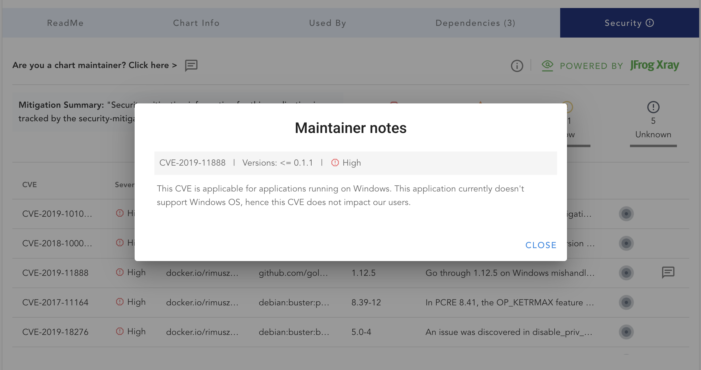

## Abstract

Security mitigation notes standard file for Helm charts.

Security Mitigation Notes are a way for the chart maintainer to add notes about CVEs that users can read to understand the status of vulnerabilities. In some cases, CVE issues may not affect the chart directly or it may be a vulnerability in a third-party dependency that the chart author does not control. This security mitigation standard allows authors to engage directly with the consumers of their charts.

The CVE (Common Vulnerabilities and Exposures) list is a public list of reported vulnerabilities sponsored by the Department of Homeland Security (DHS) Office of Cybersecurity and Information Assurance (OCSIA). Many cybersecurity companies use CVE as well as other more proprietary databases to help organizations have a clear understanding of their issues. The goal of CVE is to make it easier to share information about known vulnerabilities across organizations by creating a standardized identifier for a given vulnerability or exposure. CVE allows organizations to set a baseline for evaluating the coverage of their security tools. CVE's common identifiers allow organizations to see what each tool covers and how appropriate they are for your organization.

Security Mitigation (or sometimes referred to as security advisory provides organizations a method of commenting on CVEs that pop-up in their software. These advisory notes often provide context of the CVE, if/when it might be fixed or mitigated, and/or whether it actually affects the application. 

## Motivation

There was no easy way for chart authors to share security mitigation information. ChartCenter made it easy for chart users to read about CVEs present in charts all in one place, but we also needed to give chart authors a fair opportunity to provide these security mitigation notes on the UI. 

To fix this broken communication between authors and consumers the security mitigation standard is proposed as a yaml file that anyone in the open source community can access to view author’s comments about the CVEs.

## Rationale

Proposed Security Mitigation file in `yaml` format is a way for the chart maintainer to add security mitigation notes for CVEs. It would also allow chart maintainers to be more transparent with their charts CVEs.

The Security Mitigation file then can be adopted to display security mitigation notes information for example in [https://artifacthub.io](https://artifacthub.io) and by any other UI as well. The text in this yaml information could also be made accessible through an API that should be accessible through your local machine as well.
Helm CLI could also have a command to extract this info or fetch it from an upstream repo.

## Specification

Security mitigation provides the ability for producers to specify mitigation notes for security issues associated with their Helm chart with their consumers. Once agreed upon, this specification should be open source and available to the community. JFrog has implemented this as an example spec here: https://github.com/jfrog/chartcenter/blob/master/docs/securitymitigationspec.md

The security mitigation spec supports 3 use cases:

* Ability for producers to provide overall and/or CVE specific mitigation information.
* Ability for producers to point security to a mitigation website that is hosted externally on a wiki / webpage.
* Ability for producers to point to externally hosted security-mitigation.yaml file.

Here is a proposed `security-mitigation.yaml` notes file:

```
## Apache License Version 2.0
## http://www.apache.org/licenses/LICENSE-2.0.txt

## Schema version of this YAML file
schemaVersion: v1

## Overall mitigation summary
summary: text

## External URL if you'd like to link to an external page
securityAdvisoryUrl: URL

## If you want to point us to a file instead of filling out the CVE's here
useMitigationExternalFile: boolean
mitigationExternalFileUrl: URL

## Mitigation notes for individual CVEs
mitigations:  
 cves:
## Indicates package Uri for which the security mitigation is provided. helm://… || docker://…
 affectedPackageUri:
## Which chart versions this cve note belongs to
 affectedVersions: mastermind SemVer constraint
## Description / note
 description: text
```

Here are the used fields:

| Field  | Description | Type |
| ------------- | ------------- | ---- |
| summary  | Overall mitigation summary that applies to all chart versions  | text |
| securityAdvisoryUrl | Link pointing to a mitigation information hosted externally such as wiki, web page, etc. | url |
| useMitigationExternalFile | true means security-mitigation.yaml is hosted somewhere else. false means the content of the current file represents security mitigation information. Default value: false | true/false |
| mitigationExternalFileUrl | If useMitigationExternalFile is set to true, then this parameter points to a url of externally hosted security-mitigation.yaml | url |
| mitigations: cves | List of CVEs for which mitigation notes are being provided. | CVE-YYYY-NNNN |
| mitigations: cves: affectedPackageUri | Indicates package Uri for which the security mitigation is provided. Currently we support only two package uri: Docker docker://docker.io/bitnami/postgres Helm helm://artifactory | uri |
| mitigations: cves: affectedVersions | SemVer Constraint from Masterminds/semver as used on Chart.yaml for kubeVersion specifying which versions should use the mitigation information. | Example: > 1.2.x || < 2.5.8 |
| mitigations: cves: description | Mitigation notes at CVE level. | text description |


### Usage examples
Example 1: Ability for producers to provide overall and/or CVE specific mitigation information.

```
schemaVersion: v1
summary: This chart is secure
securityAdvisoryUrl:
mitigationExternalFileUrl:
mitigations:  
   cves:
       CVE-1234
       CVE-5432
   affectedPackageUri:
   affectedVersions: > 1.2.x || < 2.5.8
   description: This security mitigation information for CVE-1234 & CVE-5432 applies to the specified affectedVersions of charts.
   cves:
       CVE-3456
   affectedPackageUri:
   affectedVersions: 6.x || 7.x
   description: This security mitigation information for CVE-3456 applies to application versions spe & CVE-5432 applies to the specified affectedVersions of the application.
```

Example 2: Ability for producers point security mitigation information that is hosted externally on wiki / webpage.

```
schemaVersion: v1
summary: Artifactory helm chart is secure and details are mentioned in the security advisory page.
securityAdvisoryUrl: https://jfrog.com/artifactory/security-advisory.html
```

Example 3: Ability for producers to point to externally hosted security-mitigation.yaml file.

```
schemaVersion: v1
summary: Artifactory helm chart is secure and details are mentioned in the security advisory page.
securityAdvisoryUrl: https://jfrog.com/artifactory/security-advisory.html
mitigationExternalFileUrl: https://jfrog.com/artifactory/security-mitigation.yaml
```

Presence of `security-mitigation.yaml` file in the chart also represents intent for producers to be transparent with all high severity issues with their consumers.

We propose that this file be included in the chart itself is. Since CVEs can change if dependencies change across versions, a security-mitigation.yaml file that is included in each chart when new versions are released is the best way to keep the mitigation notes up to date. 

Further, it’s important to keep the chart author/maintainer contact information (email) updated so that there is a way to verify the mitigation notes with the correct chart owner(s).

## Backwards compatibility

None

## Security implications

None

## Education

An effort (a blog post) will be needed to educate chart developers and maintainers how to apply the HIP to their charts.

## Reference implementation

The Security Mitigation is already implemented and used at [https://chartcenter.io](https://chartcenter.io)
An example of the implemented security mitigation notes:
* https://github.com/rimusz/charts/blob/master/stable/security-sample-chart/security-mitigation.yaml
* https://chartcenter.io/rimusz/security-sample-chart?version=0.1.5&tab=security



## Rejected ideas

None

## Open issues

None

## References

- https://github.com/jfrog/chartcenter/blob/master/docs/security-mitigation.yaml
- https://github.com/jfrog/chartcenter/blob/master/docs/securitymitigationspec.md
- https://chartcenter.io
- https://chartcenter.io/bitnami/postgresql?tab=security
- 

